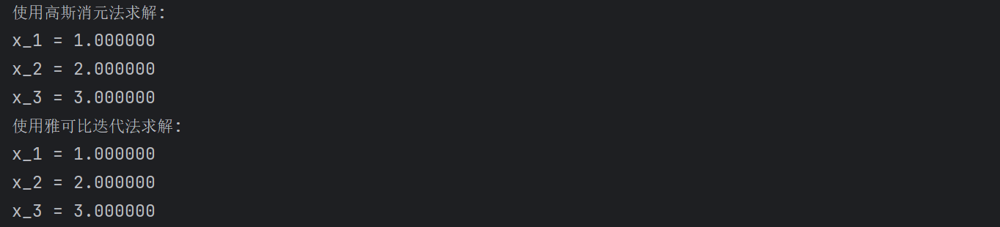
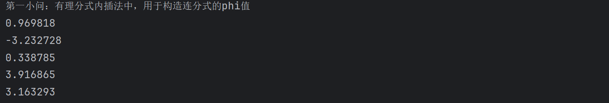
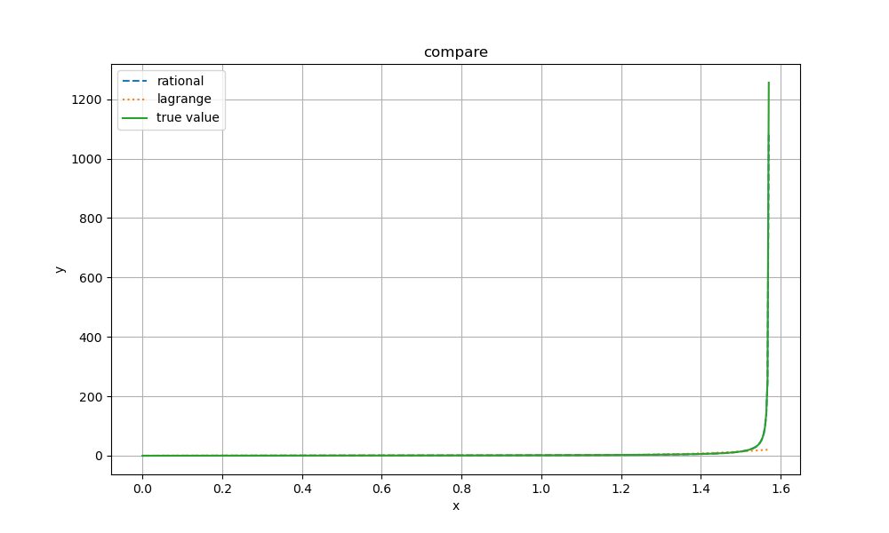
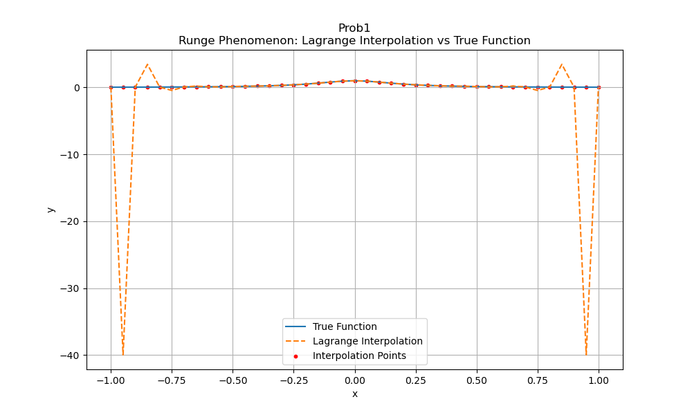
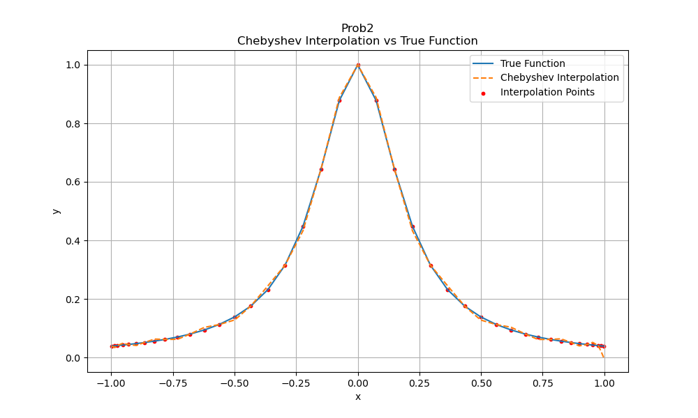
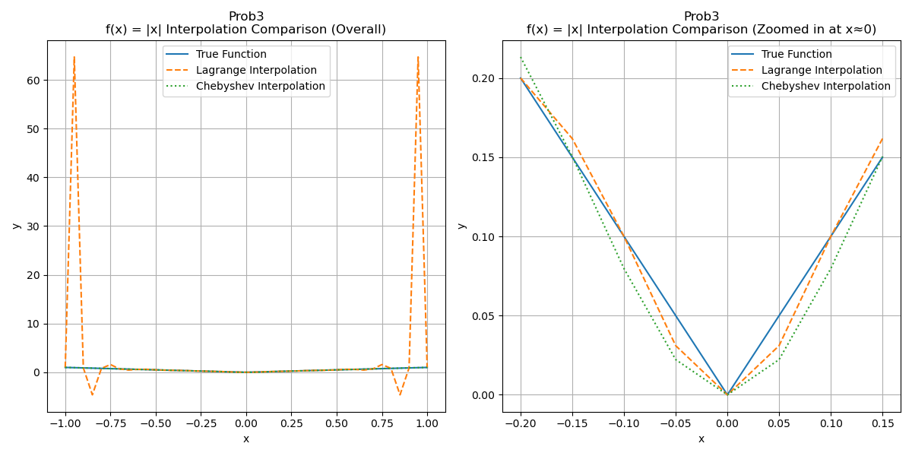
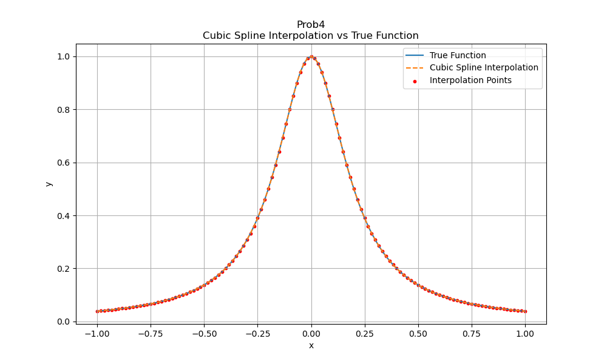
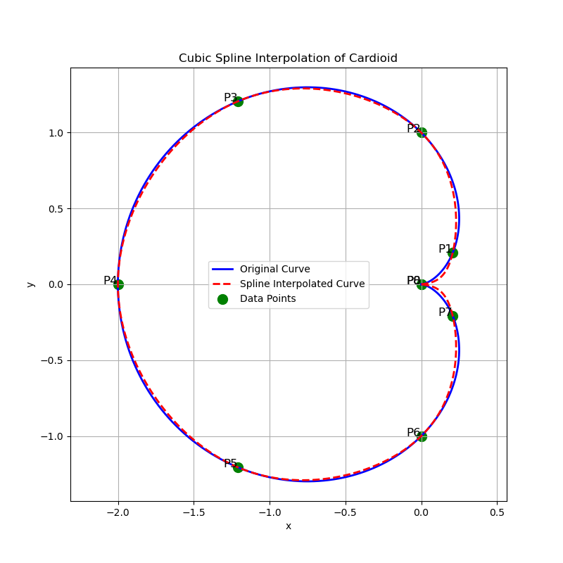
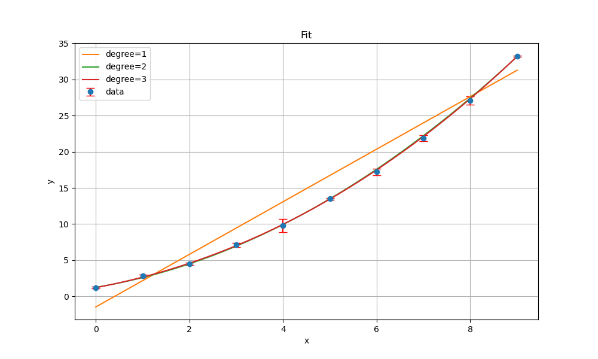

# 计算物理第二次作业

## 第一题

高斯消元法原理见课件。雅可比迭代法求解线性方程组$Ax=b$的核心思想：
$$
x^{(k+1)} = D^{-1}[b - (L + U)x^{(k)}],\quad k=0, 1, 2, \cdots
$$
其中，$A=D+L+U$，$D$是$A$的对角矩阵，$L$是$A$的严格下三角矩阵，$U$是$A$的严格上三角矩阵。

关键代码实现：

```python
for iteration in range(max_iterations):
    x_new = np.zeros(n)
    for i in range(n):
        sum1 = np.dot(A[i, :i], x[:i])  # L部分，即Σ_(j=0)^(i-1) a_ij * x_j
        sum2 = np.dot(A[i, i + 1:], x[i + 1:])  # U部分，即Σ_(j=i+1)^(n-1) a_ij * x_j
        x_new[i] = (b[i] - sum1 - sum2) / A[i, i]  # 迭代公式：x_i^(k+1)=(b_i - Σ_(j≠i) a_ij* x_j^(k)) / a_ii
```

运行得到结果：



## 第二题

### 第一小问

按照题目要求构造即可。关键代码：

```python
# 初始化一个二维数组来存储中间计算结果
phi = np.zeros((n, n))

# 填充 phi 的第一列y_values
for i in range(n):
    phi[i][0] = y_values[i]

# 递推计算 phi 的其他列
for i in range(1, n):  # phi 的行
    for j in range(1, i+1):  # phi 的列
        numerator = x_values[j-1] - x_values[i]
        denominator = phi[j-1][j-1] - phi[i][j-1]
        phi[i][j] = numerator / denominator

# 提取对角线上的值作为结果
result = [phi[i][i] for i in range(1, n)]
```

此代码构造一个矩阵$phi$，形式上满足
$$
phi=\left[
\begin{matrix}
	y_0 & & & \\
	y_1 & \phi(x_0,x_1) & & \\
	y_2 & \phi(x_0,x_2) & \phi(x_0,x_1,x_2) & \\
	y_3 & \phi(x_0,x_3) & \phi(x_0,x_1,x_3) & \phi(x_0,x_1,x_2,x_3) \\
	\cdots
\end{matrix}
\right]
$$
得到的$\phi (x_0,x_1,\cdots,x_n)$结果为



### 第二小问

根据题意，可以画出有理分式插值和拉格朗日多项式插值的图像



得到的结果


从图像以及误差平方和可以看出，有理分式内插法的误差明显小于拉格朗日插值法，说明有理分式内插法在本例中表现更好，能够更准确地逼近函数$tan(x)$的值。

## 第三题

### 第一小问

采用拉格朗日多项式内插法。

| x | f(x) | P20(x) | \|f(x)-P20(x)\| |
|----|--------|-----------|----------------|
| -1.000000 | 0.038462 | 0.038462 | 0.000000e+00 |
| -0.950000 | 0.042440 | -39.952449 | 3.999489e+01 |
| -0.900000 | 0.047059 | 0.047059 | 0.000000e+00 |
| -0.850000 | 0.052459 | 3.454958 | 3.402499e+00 |
| -0.800000 | 0.058824 | 0.058824 | 0.000000e+00 |
| -0.750000 | 0.066390 | -0.447052 | 5.134420e-01 |
| -0.700000 | 0.075472 | 0.075472 | 0.000000e+00 |
| -0.650000 | 0.086486 | 0.202423 | 1.159361e-01 |
| -0.600000 | 0.100000 | 0.100000 | 0.000000e+00 |
| -0.550000 | 0.116788 | 0.080660 | 3.612833e-02 |
| -0.500000 | 0.137931 | 0.137931 | 0.000000e+00 |
| -0.450000 | 0.164948 | 0.179763 | 1.481418e-02 |
| -0.400000 | 0.200000 | 0.200000 | 0.000000e+00 |
| -0.350000 | 0.246154 | 0.238446 | 7.707912e-03 |
| -0.300000 | 0.307692 | 0.307692 | 0.000000e+00 |
| -0.250000 | 0.390244 | 0.395093 | 4.849151e-03 |
| -0.200000 | 0.500000 | 0.500000 | 0.000000e+00 |
| -0.150000 | 0.640000 | 0.636755 | 3.244664e-03 |
| -0.100000 | 0.800000 | 0.800000 | 0.000000e+00 |
| -0.050000 | 0.941176 | 0.942490 | 1.313909e-03 |
| 0.000000 | 1.000000 | 1.000000 | 0.000000e+00 |
| 0.050000 | 0.941176 | 0.942490 | 1.313909e-03 |
| 0.100000 | 0.800000 | 0.800000 | 0.000000e+00 |
| 0.150000 | 0.640000 | 0.636755 | 3.244664e-03 |
| 0.200000 | 0.500000 | 0.500000 | 0.000000e+00 |
| 0.250000 | 0.390244 | 0.395093 | 4.849151e-03 |
| 0.300000 | 0.307692 | 0.307692 | 0.000000e+00 |
| 0.350000 | 0.246154 | 0.238446 | 7.707912e-03 |
| 0.400000 | 0.200000 | 0.200000 | 0.000000e+00 |
| 0.450000 | 0.164948 | 0.179763 | 1.481418e-02 |
| 0.500000 | 0.137931 | 0.137931 | 0.000000e+00 |
| 0.550000 | 0.116788 | 0.080660 | 3.612833e-02 |
| 0.600000 | 0.100000 | 0.100000 | 0.000000e+00 |
| 0.650000 | 0.086486 | 0.202423 | 1.159361e-01 |
| 0.700000 | 0.075472 | 0.075472 | 0.000000e+00 |
| 0.750000 | 0.066390 | -0.447052 | 5.134420e-01 |
| 0.800000 | 0.058824 | 0.058824 | 0.000000e+00 |
| 0.850000 | 0.052459 | 3.454958 | 3.402499e+00 |
| 0.900000 | 0.047059 | 0.047059 | 0.000000e+00 |
| 0.950000 | 0.042440 | -39.952449 | 3.999489e+01 |
| 1.000000 | 0.038462 | 0.038462 | 0.000000e+00 |

插值结果如图所示



可以看到，使用均匀分布节点的拉格朗日插值法在区间端点附近出现了较大的误差，即Runge现象。

### 第二小问

由题，构造Chebyshev多项式，关键代码：

```python
# 计算系数ck
c = []
for k in range(n):
    sum_ck = 0
    for j in range(1, n):
        sum_ck += y_values[j] * np.cos(k * (2 * j + 1) * np.pi / (2 * n))
    ck = (2 / n) * sum_ck
    # 特殊处理c0
    if k == 0:
        ck = ck / 2
        c.append(ck)
```

上述代码计算系数$c_k= \frac{2-\delta_{0k}}{n} \Sigma_{j=0}^{n-1} \cos{(\frac{k\pi(j+1/2)}{n})} f[\cos(\frac{\pi(j+1/2)}{n})]$。

```python
# 计算bk(x)并计算插值结果
results = []
for xi in x:
    b_kplus2 = 0
    b_kplus1 = 0
    for k in range(n - 1, 0, -1):
        b_k = 2 * xi * b_kplus1 - b_kplus2 + c[k]
        b_kplus2 = b_kplus1
        b_kplus1 = b_k
    fx = xi * b_kplus1 - b_kplus2 + c[0]
    results.append(fx)
```

上述代码根据Clenshaw算法计算Chebyshev展开：由于Chebyshev多项式满足
$$
T_{k+1}(x) = 2xT_k(x) - T_{k-1}(x)
$$
构造新函数$b(x)$满足
$$
b_{n+1}(x) = 0, b_{n+2}(x) = 0,\\
b_k(x) = 2xb_{k+1}(x) - b_{k+2}(x) + c_k
$$
迭代，最终得到
$$
f(x) = c_0 + xb_1(x) - b_2(x)
$$
插值结果列表如下：

| x         | f(x)     | Chebyshev P(x) | \|f(x)-P(x)\| |
| :-------- | :------- | :------------- | :------------ |
| 0.997204  | 0.038669 | 0.038669       | 2.428613e-16  |
| 0.986066  | 0.039513 | 0.033909       | 5.604426e-03  |
| 0.974928  | 0.040384 | 0.040384       | 6.938894e-17  |
| 0.952901  | 0.042193 | 0.048283       | 6.089916e-03  |
| 0.930874  | 0.044124 | 0.044124       | 1.457168e-16  |
| 0.898450  | 0.047214 | 0.040722       | 6.491971e-03  |
| 0.866025  | 0.050633 | 0.050633       | 2.775558e-17  |
| 0.823928  | 0.055644 | 0.062686       | 7.042324e-03  |
| 0.781831  | 0.061419 | 0.061419       | 4.302114e-16  |
| 0.731002  | 0.069642 | 0.061809       | 7.833155e-03  |
| 0.680173  | 0.079581 | 0.079581       | 1.110223e-16  |
| 0.621746  | 0.093772 | 0.102750       | 8.978870e-03  |
| 0.563320  | 0.111942 | 0.111942       | 2.636780e-16  |
| 0.498602  | 0.138598 | 0.127950       | 1.064818e-02  |
| 0.433884  | 0.175243 | 0.175243       | 1.665335e-16  |
| 0.364319  | 0.231577 | 0.244581       | 1.300395e-02  |
| 0.294755  | 0.315257 | 0.315257       | 0.000000e+00  |
| 0.221899  | 0.448234 | 0.432901       | 1.533323e-02  |
| 0.149042  | 0.642946 | 0.642946       | 4.440892e-16  |
| 0.074521  | 0.878090 | 0.888179       | 1.008852e-02  |
| 0.000000  | 1.000000 | 1.000000       | 6.661338e-16  |
| -0.074521 | 0.878090 | 0.888179       | 1.008852e-02  |
| -0.149042 | 0.642946 | 0.642946       | 7.771561e-16  |
| -0.221899 | 0.448234 | 0.432901       | 1.533323e-02  |
| -0.294755 | 0.315257 | 0.315257       | 1.665335e-16  |
| -0.364319 | 0.231577 | 0.244581       | 1.300395e-02  |
| -0.433884 | 0.175243 | 0.175243       | 3.053113e-16  |
| -0.498602 | 0.138598 | 0.127950       | 1.064818e-02  |
| -0.563320 | 0.111942 | 0.111942       | 2.359224e-16  |
| -0.621746 | 0.093772 | 0.102750       | 8.978870e-03  |
| -0.680173 | 0.079581 | 0.079581       | 8.326673e-17  |
| -0.731002 | 0.069642 | 0.061809       | 7.833155e-03  |
| -0.781831 | 0.061419 | 0.061419       | 5.412337e-16  |
| -0.823928 | 0.055644 | 0.062686       | 7.042324e-03  |
| -0.866025 | 0.050633 | 0.050633       | 6.938894e-16  |
| -0.898450 | 0.047214 | 0.040722       | 6.491971e-03  |
| -0.930874 | 0.044124 | 0.044124       | 2.289835e-16  |
| -0.952901 | 0.042193 | 0.048283       | 6.089916e-03  |
| -0.974928 | 0.040384 | 0.040384       | 1.804112e-16  |
| -0.986066 | 0.039513 | 0.033909       | 5.604426e-03  |
| -0.997204 | 0.038669 | 0.038669       | 7.632783e-17  |

结果图：



可以看到，Chebyshev 多项式插值法在整个区间上的误差显著小于均匀分布节点的拉格朗日插值法，避免了Runge现象。

### 第三小问

对拉格朗日多项式构造使用$n=21$的线性节点，对Chebyshev多项式构造使用Chebyshev节点；对两者使用$n=41$的线性节点进行插值，结果列表如下：

| x         | f(x)     | Lagrange P(x) | Chebyshev P(x) | \|f(x)-Lagrange P(x)\| | \|f(x)-Chebyshev P(x)\| |
| :-------- | :------- | :------------ | :------------- | :--------------------- | :---------------------- |
| -1.000000 | 1.000000 | 1.000000      | 0.996451       | 0.000000e+00           | 3.548840e-03            |
| -0.950000 | 0.950000 | 64.706500     | 0.946543       | 6.375650e+01           | 3.457342e-03            |
| -0.900000 | 0.900000 | 0.900000      | 0.903929       | 0.000000e+00           | 3.928991e-03            |
| -0.850000 | 0.850000 | -4.622894     | 0.847466       | 5.472894e+00           | 2.534459e-03            |
| -0.800000 | 0.800000 | 0.800000      | 0.797425       | 0.000000e+00           | 2.575300e-03            |
| -0.750000 | 0.750000 | 1.586376      | 0.754048       | 8.363759e-01           | 4.048172e-03            |
| -0.700000 | 0.700000 | 0.700000      | 0.702729       | 0.000000e+00           | 2.729059e-03            |
| -0.650000 | 0.650000 | 0.457604      | 0.645960       | 1.923961e-01           | 4.039840e-03            |
| -0.600000 | 0.600000 | 0.600000      | 0.595285       | 0.000000e+00           | 4.715300e-03            |
| -0.550000 | 0.550000 | 0.611706      | 0.552083       | 6.170631e-02           | 2.083172e-03            |
| -0.500000 | 0.500000 | 0.500000      | 0.506891       | 0.000000e+00           | 6.891401e-03            |
| -0.450000 | 0.450000 | 0.423458      | 0.452798       | 2.654191e-02           | 2.797582e-03            |
| -0.400000 | 0.400000 | 0.400000      | 0.394040       | 0.000000e+00           | 5.959573e-03            |
| -0.350000 | 0.350000 | 0.365067      | 0.341049       | 1.506700e-02           | 8.950725e-03            |
| -0.300000 | 0.300000 | 0.300000      | 0.298750       | 0.000000e+00           | 1.250192e-03            |
| -0.250000 | 0.250000 | 0.238656      | 0.260466       | 1.134449e-02           | 1.046558e-02            |
| -0.200000 | 0.200000 | 0.200000      | 0.213299       | 0.000000e+00           | 1.329888e-02            |
| -0.150000 | 0.150000 | 0.161763      | 0.150375       | 1.176288e-02           | 3.747622e-04            |
| -0.100000 | 0.100000 | 0.100000      | 0.079707       | 0.000000e+00           | 2.029302e-02            |
| -0.050000 | 0.050000 | 0.031045      | 0.022254       | 1.895460e-02           | 2.774584e-02            |
| 0.000000  | 0.000000 | 0.000000      | -0.000000      | 0.000000e+00           | 1.776357e-15            |
| 0.050000  | 0.050000 | 0.031045      | 0.022254       | 1.895460e-02           | 2.774584e-02            |
| 0.100000  | 0.100000 | 0.100000      | 0.079707       | 0.000000e+00           | 2.029302e-02            |
| 0.150000  | 0.150000 | 0.161763      | 0.150375       | 1.176288e-02           | 3.747622e-04            |
| 0.200000  | 0.200000 | 0.200000      | 0.213299       | 0.000000e+00           | 1.329888e-02            |
| 0.250000  | 0.250000 | 0.238656      | 0.260466       | 1.134449e-02           | 1.046558e-02            |
| 0.300000  | 0.300000 | 0.300000      | 0.298750       | 0.000000e+00           | 1.250192e-03            |
| 0.350000  | 0.350000 | 0.365067      | 0.341049       | 1.506700e-02           | 8.950725e-03            |
| 0.400000  | 0.400000 | 0.400000      | 0.394040       | 0.000000e+00           | 5.959573e-03            |
| 0.450000  | 0.450000 | 0.423458      | 0.452798       | 2.654191e-02           | 2.797582e-03            |
| 0.500000  | 0.500000 | 0.500000      | 0.506891       | 0.000000e+00           | 6.891401e-03            |
| 0.550000  | 0.550000 | 0.611706      | 0.552083       | 6.170631e-02           | 2.083172e-03            |
| 0.600000  | 0.600000 | 0.600000      | 0.595285       | 0.000000e+00           | 4.715300e-03            |
| 0.650000  | 0.650000 | 0.457604      | 0.645960       | 1.923961e-01           | 4.039840e-03            |
| 0.700000  | 0.700000 | 0.700000      | 0.702729       | 0.000000e+00           | 2.729059e-03            |
| 0.750000  | 0.750000 | 1.586376      | 0.754048       | 8.363759e-01           | 4.048172e-03            |
| 0.800000  | 0.800000 | 0.800000      | 0.797425       | 0.000000e+00           | 2.575300e-03            |
| 0.850000  | 0.850000 | -4.622894     | 0.847466       | 5.472894e+00           | 2.534459e-03            |
| 0.900000  | 0.900000 | 0.900000      | 0.903929       | 0.000000e+00           | 3.928991e-03            |
| 0.950000  | 0.950000 | 64.706500     | 0.946543       | 6.375650e+01           | 3.457342e-03            |
| 1.000000  | 1.000000 | 1.000000      | 0.996451       | 0.000000e+00           | 3.548840e-03            |

结果图如下：



对于$f(x) = |x|$，在$x ≈ 0$附近，均匀分布节点的拉格朗日插值法和Chebyshev插值法均存在一定的误差。这是因为$f(x)$在$x=0$处不可导，导致插值多项式难以准确逼近该点的行为。

### 第四小问

三次样条函数构造采用课件中的公式：
$$
S(x)=-\frac{M_j}{6h_j}(x-x_{j+1})^3 + \frac{M_{j+1}}{6h_j} (x-x_j)^3 + A_j(x-x_j) + B_j, \quad x \in [x_j,\, x_{j+1}]
$$
其中，
$$
M_j=S''(x_j), \quad A_j=\frac{y_{j+1}-y_j}{h_j}-\frac{h_j}{6}(M_{j+1}-M_j),\quad B_j=y_j-M_j \frac{h_j^2}{6},\quad j=0, \cdots,n
$$
再由导函数连续得到
$$
\mu M_{j-1}+2M_j+\lambda_jM_{j+1}=d_j, \quad j=1, \cdots,n-1
$$
这是一个线性方程组$Am=b$，其中
$$
\mu_j=\frac{h_{j-1}}{h_{j-1}+h_j},\quad \lambda_j=\frac{h_j}{h_{j-1}+h_j}, \\
d_j=6[\frac{y_{j-1}}{h_{j-1}(h_{j-1}+h_j)}+\frac{y_{j+1}}{h_{j}(h_{j-1}+h_j)}-\frac{y_{j}}{h_{j-1}h_j}]
$$
再取边界条件
$$
S''(x_0)=S''(x_n)=0
$$
即可解出三次样条函数$S(x)$。

关键代码：

```python
# 定义区间长度hi，以及构造线性方程组求解三次样条函数的矩m（二阶导数），其中mi满足μi * m_(i-1) + 2 * mi + λi * m_(i+1) = di，i = 1, 2, ..., n-2。其中μi = h_(i-1) / (hi + h_(i-1))，λi = hi / (hi + h_(i-1))，di = 6 * (y_(i+1) / h_(i-1)*(h_(i-1)+hi) - yi / hi*h_(i-1) + y_(i-1) / h_(i-1)*(h_(i-1)+hi))
h = [x_values[i + 1] - x_values[i] for i in range(n - 1)]
A = np.zeros((n-2, n-2))
b = np.zeros(n-2)
m = np.zeros(n)  # 取边界条件m_0 = m_(n-1) = 0
for i in range(1, n - 1):
    if i != 1:
        A[i - 1][i - 2] = h[i - 1] / (h[i - 1] + h[i])  # μi
    A[i - 1][i - 1] = 2
    if i != n - 2:
        A[i - 1][i] = h[i] / (h[i - 1] + h[i])  # λi
    b[i - 1] = 6 * ((y_values[i + 1] / h[i]) - (y_values[i] * (h[i - 1] + h[i]) / (h[i - 1] * h[i])) + (y_values[i - 1] / h[i - 1])) / (h[i - 1] + h[i])
```

上述代码构造样条函数的矩$M_j$的数组`m`，以及它满足的线性方程组的系数矩阵`A`、常数项`b`。

```python
# 求解线性方程组
m[1:n-1] = gaussian_elimination(A, b)

# 计算插值结果
if x is not None:
    results = []
    for xi in x:
        # 找到xi所在的区间[xi, xi+1]
        for i in range(n - 1):
            if x_values[i] <= xi <= x_values[i + 1]:
                break
        hi = h[i]
        Ai = -m[i] / (6 * hi)
        Bi = m[i + 1] / (6 * hi)
        Ci = (y_values[i + 1] - y_values[i]) / hi - hi * (m[i + 1] - m[i]) / 6
        Di = y_values[i] - m[i] * hi ** 2 / 6
        dxi = xi - x_values[i]
        dxi1 = xi - x_values[i + 1]
        fx = Ai * dxi1 ** 3 + Bi * dxi ** 3 + Ci * dxi + Di
        results.append(fx)
```

上述代码解出方程组，并根据前面提到的公式，计算出$S(x)$的各项系数，给出插值结果。

对于利用61个点进行构造、121个点进行插值的$S(x)$结果列表如下：

| x         | f(x)     | Spline P(x) | \|f(x)-P(x)\| |
| :-------- | :------- | :---------- | :------------ |
| -1.000000 | 0.038462 | 0.038462    | 0.000000e+00  |
| -0.983333 | 0.039724 | 0.039735    | 1.067215e-05  |
| -0.966667 | 0.041049 | 0.041049    | 0.000000e+00  |
| -0.950000 | 0.042440 | 0.042437    | 2.878242e-06  |
| -0.933333 | 0.043902 | 0.043902    | 0.000000e+00  |
| -0.916667 | 0.045440 | 0.045441    | 7.486737e-07  |
| -0.900000 | 0.047059 | 0.047059    | 0.000000e+00  |
| -0.883333 | 0.048764 | 0.048764    | 2.280168e-07  |
| -0.866667 | 0.050562 | 0.050562    | 0.000000e+00  |
| -0.850000 | 0.052459 | 0.052459    | 2.759549e-08  |
| -0.833333 | 0.054463 | 0.054463    | 0.000000e+00  |
| -0.816667 | 0.056582 | 0.056581    | 4.857091e-08  |
| -0.800000 | 0.058824 | 0.058824    | 0.000000e+00  |
| -0.783333 | 0.061198 | 0.061198    | 3.788894e-08  |
| -0.766667 | 0.063717 | 0.063717    | 0.000000e+00  |
| -0.750000 | 0.066390 | 0.066390    | 5.314760e-08  |
| -0.733333 | 0.069231 | 0.069231    | 0.000000e+00  |
| -0.716667 | 0.072253 | 0.072253    | 6.494483e-08  |
| -0.700000 | 0.075472 | 0.075472    | 0.000000e+00  |
| -0.683333 | 0.078904 | 0.078904    | 8.224600e-08  |
| -0.666667 | 0.082569 | 0.082569    | 0.000000e+00  |
| -0.650000 | 0.086486 | 0.086486    | 1.040870e-07  |
| -0.633333 | 0.090680 | 0.090680    | 0.000000e+00  |
| -0.616667 | 0.095175 | 0.095175    | 1.326147e-07  |
| -0.600000 | 0.100000 | 0.100000    | 0.000000e+00  |
| -0.583333 | 0.105186 | 0.105186    | 1.696976e-07  |
| -0.566667 | 0.110769 | 0.110769    | 0.000000e+00  |
| -0.550000 | 0.116788 | 0.116788    | 2.179074e-07  |
| -0.533333 | 0.123288 | 0.123288    | 0.000000e+00  |
| -0.516667 | 0.130317 | 0.130316    | 2.802078e-07  |
| -0.500000 | 0.137931 | 0.137931    | 0.000000e+00  |
| -0.483333 | 0.146193 | 0.146193    | 3.596533e-07  |
| -0.466667 | 0.155172 | 0.155172    | 0.000000e+00  |
| -0.450000 | 0.164948 | 0.164948    | 4.582632e-07  |
| -0.433333 | 0.175610 | 0.175610    | 0.000000e+00  |
| -0.416667 | 0.187256 | 0.187256    | 5.742351e-07  |
| -0.400000 | 0.200000 | 0.200000    | 0.000000e+00  |
| -0.383333 | 0.213967 | 0.213967 | 6.954801e-07 |
| -0.366667 | 0.229299 | 0.229299 | 0.000000e+00 |
| -0.350000 | 0.246154 | 0.246153 | 7.854546e-07 |
| -0.333333 | 0.264706 | 0.264706 | 0.000000e+00 |
| -0.316667 | 0.285149 | 0.285148 | 7.537022e-07 |
| -0.300000 | 0.307692 | 0.307692 | 0.000000e+00 |
| -0.283333 | 0.332564 | 0.332563 | 3.989269e-07 |
| -0.266667 | 0.360000 | 0.360000 | 0.000000e+00 |
| -0.250000 | 0.390244 | 0.390245 | 6.869290e-07 |
| -0.233333 | 0.423529 | 0.423529 | 0.000000e+00 |
| -0.216667 | 0.460064 | 0.460067 | 3.230584e-06 |
| -0.200000 | 0.500000 | 0.500000 | 0.000000e+00 |
| -0.183333 | 0.543396 | 0.543404 | 8.221454e-06 |
| -0.166667 | 0.590164 | 0.590164 | 0.000000e+00 |
| -0.150000 | 0.640000 | 0.640016 | 1.602966e-05 |
| -0.133333 | 0.692308 | 0.692308 | 0.000000e+00 |
| -0.116667 | 0.746114 | 0.746137 | 2.337071e-05 |
| -0.100000 | 0.800000 | 0.800000 | 0.000000e+00 |
| -0.083333 | 0.852071 | 0.852090 | 1.863022e-05 |
| -0.066667 | 0.900000 | 0.900000 | 0.000000e+00 |
| -0.050000 | 0.941176 | 0.941164 | 1.229233e-05 |
| -0.033333 | 0.972973 | 0.972973 | 0.000000e+00 |
| -0.016667 | 0.993103 | 0.993051 | 5.250014e-05 |
| 0.000000  | 1.000000 | 1.000000 | 0.000000e+00 |
| 0.016667  | 0.993103 | 0.993051 | 5.250014e-05 |
| 0.033333  | 0.972973 | 0.972973 | 1.110223e-16 |
| 0.050000  | 0.941176 | 0.941164 | 1.229233e-05 |
| 0.066667  | 0.900000 | 0.900000 | 0.000000e+00 |
| 0.083333  | 0.852071 | 0.852090 | 1.863022e-05 |
| 0.100000  | 0.800000 | 0.800000 | 0.000000e+00 |
| 0.116667  | 0.746114 | 0.746137 | 2.337071e-05 |
| 0.133333  | 0.692308 | 0.692308 | 0.000000e+00 |
| 0.150000  | 0.640000 | 0.640016 | 1.602966e-05 |
| 0.166667  | 0.590164 | 0.590164 | 0.000000e+00 |
| 0.183333  | 0.543396 | 0.543404 | 8.221454e-06 |
| 0.200000  | 0.500000 | 0.500000 | 0.000000e+00 |
| 0.216667  | 0.460064 | 0.460067 | 3.230584e-06 |
| 0.233333  | 0.423529 | 0.423529 | 0.000000e+00 |
| 0.250000  | 0.390244 | 0.390245 | 6.869290e-07 |
| 0.266667  | 0.360000 | 0.360000 | 0.000000e+00 |
| 0.283333  | 0.332564 | 0.332563 | 3.989269e-07 |
| 0.300000  | 0.307692 | 0.307692 | 0.000000e+00 |
| 0.316667  | 0.285149 | 0.285148 | 7.537022e-07 |
| 0.333333  | 0.264706 | 0.264706 | 0.000000e+00 |
| 0.350000  | 0.246154 | 0.246153 | 7.854546e-07 |
| 0.366667  | 0.229299 | 0.229299 | 2.775558e-17 |
| 0.383333  | 0.213967 | 0.213967 | 6.954801e-07 |
| 0.400000  | 0.200000 | 0.200000 | 0.000000e+00 |
| 0.416667  | 0.187256 | 0.187256 | 5.742351e-07 |
| 0.433333  | 0.175610 | 0.175610 | 0.000000e+00 |
| 0.450000  | 0.164948 | 0.164948 | 4.582632e-07 |
| 0.466667  | 0.155172 | 0.155172 | 0.000000e+00 |
| 0.483333  | 0.146193 | 0.146193 | 3.596533e-07 |
| 0.500000  | 0.137931 | 0.137931 | 0.000000e+00 |
| 0.516667  | 0.130317 | 0.130316 | 2.802078e-07 |
| 0.533333  | 0.123288 | 0.123288 | 1.387779e-17 |
| 0.550000  | 0.116788 | 0.116788 | 2.179074e-07 |
| 0.566667  | 0.110769 | 0.110769 | 0.000000e+00 |
| 0.583333  | 0.105186 | 0.105186 | 1.696976e-07 |
| 0.600000  | 0.100000 | 0.100000 | 0.000000e+00 |
| 0.616667  | 0.095175 | 0.095175 | 1.326147e-07 |
| 0.633333  | 0.090680 | 0.090680 | 0.000000e+00 |
| 0.650000  | 0.086486 | 0.086486 | 1.040870e-07 |
| 0.666667  | 0.082569 | 0.082569 | 0.000000e+00 |
| 0.683333  | 0.078904 | 0.078904 | 8.224600e-08 |
| 0.700000  | 0.075472 | 0.075472 | 0.000000e+00 |
| 0.716667  | 0.072253 | 0.072253 | 6.494483e-08 |
| 0.733333  | 0.069231 | 0.069231 | 0.000000e+00 |
| 0.750000  | 0.066390 | 0.066390 | 5.314760e-08 |
| 0.766667  | 0.063717 | 0.063717 | 0.000000e+00 |
| 0.783333  | 0.061198 | 0.061198 | 3.788894e-08 |
| 0.800000  | 0.058824 | 0.058824 | 0.000000e+00 |
| 0.816667  | 0.056582 | 0.056581 | 4.857091e-08 |
| 0.833333  | 0.054463 | 0.054463 | 0.000000e+00 |
| 0.850000  | 0.052459 | 0.052459 | 2.759549e-08 |
| 0.866667  | 0.050562 | 0.050562 | 0.000000e+00 |
| 0.883333  | 0.048764 | 0.048764 | 2.280168e-07 |
| 0.900000  | 0.047059 | 0.047059 | 0.000000e+00 |
| 0.916667  | 0.045440 | 0.045441 | 7.486737e-07 |
| 0.933333  | 0.043902 | 0.043902 | 0.000000e+00 |
| 0.950000  | 0.042440 | 0.042437 | 2.878242e-06 |
| 0.966667  | 0.041049 | 0.041049 | 0.000000e+00 |
| 0.983333  | 0.039724 | 0.039735 | 1.067215e-05 |
| 1.000000  | 0.038462 | 0.038462 | 0.000000e+00 |

结果图如下：



三次样条插值法在整个区间上表现出良好的逼近效果，误差很小，效果好于Chebyshev多项式和拉格朗日多项式，且没有出现Runge现象。这是因为，三次样条函数是使得一个函数的模
$$
||f||=\int_a^b dx|f''(x)|^2
$$
最小的函数，而这个模从某种意义上是衡量函数在区间上曲率模方的大小。因此，三次样条函数是最“光滑”的函数。

### 第五小问

分布曲线如下所示：


Lebesgue 数衡量了插值过程中的误差放大效应。对于均匀分布节点，Lebesgue 数在区间端点附近显著增大，表明误差可能被放大，导致Runge现象的出现。而Chebyshev节点的Lebesgue数相对较小且分布更均匀，说明其插值过程中的误差放大效应较小，更稳定。因此，选择合适的插值节点对于控制插值误差至关重要。

Lebesgue 数确实存在下限，且对于任意节点分布，其Lebesgue 数的下限均大于等于1。这是因为在插值过程中，至少会有一个基函数在某些点处取值为1。例如对于基函数$L_i(x)$，当$x=x_i$时，$L_i(x_i)=1$，则Lebesgue函数$\Lambda(x)=\Sigma_i |L_i(x)|$在该点处至少为1。因此Lebesgue数有下限，且至少为1。

## 第四题

### 第一小问

计算得到的值如下：

| $t$  | $x_t=r(\phi)\cos\phi$             | $y_t=r(\phi)\cos\phi$             |
| ---- | --------------------------------- | --------------------------------- |
| 0    | 0                                 | 0                                 |
| 1    | $\frac{\sqrt{2}}{2}-\frac{1}{2}$  | $\frac{\sqrt{2}}{2}-\frac{1}{2}$  |
| 2    | 0                                 | 1                                 |
| 3    | $-\frac{\sqrt{2}}{2}-\frac{1}{2}$ | $\frac{\sqrt{2}}{2}+\frac{1}{2}$  |
| 4    | -2                                | 0                                 |
| 5    | $-\frac{\sqrt{2}}{2}-\frac{1}{2}$ | $-\frac{\sqrt{2}}{2}-\frac{1}{2}$ |
| 6    | 0                                 | -1                                |
| 7    | $\frac{\sqrt{2}}{2}-\frac{1}{2}$  | $-\frac{\sqrt{2}}{2}+\frac{1}{2}$ |
| 8    | 0                                 | 0                                 |

### 第二小问

函数中的小数保留6位有效数字：

$$ S_\Delta(X; t) =
\begin{cases}
t \cdot (0.245602 - 0.038495t^2) &, \quad t \in [0, 1] \\
-0.221738t^3 + 0.54973t^2 - 0.304128t + 0.183243 &, \quad t \in [1, 2] \\
0.339662t^3 - 2.81867t^2 + 6.43268t - 4.30796 &, \quad t \in [2, 3] \\
0.277304t^3 - 2.25745t^2 + 4.749t - 2.62428 &, \quad t \in [3, 4] \\
-0.277304t^3 + 4.39784t^2 - 21.8721t + 32.8706 &, \quad t \in [4, 5] \\
-0.339662t^3 + 5.33322t^2 - 26.549t + 40.6654 &, \quad t \in [5, 6] \\
0.221738t^3 - 4.77199t^2 + 34.0822t - 80.5971 &, \quad t \in [6, 7] \\
-0.245602t + 19.7095 \cdot (0.125t - 1)^3 + 1.96481 &, \quad t \in [7, 8]
\end{cases} $$

$$ S_\Delta(Y; t) =
\begin{cases}
t \cdot (0.173495t^2 + 0.0336116) &, \quad t \in [0, 1] \\
-0.281689t^3 + 1.36555t^2 - 1.33194t + 0.455185 &, \quad t \in [1, 2] \\
-0.218311t^3 + 0.985281t^2 - 0.571398t - 0.051845 &, \quad t \in [2, 3] \\
0.326505t^3 - 3.91806t^2 + 14.1386t - 14.7619 &, \quad t \in [3, 4] \\
0.326505t^3 - 3.91806t^2 + 14.1386t - 14.7619 &, \quad t \in [4, 5] \\
-0.218311t^3 + 4.25417t^2 - 26.7225t + 53.3401 &, \quad t \in [5, 6] \\
-0.281689t^3 + 5.39499t^2 - 33.5674t + 67.0299 &, \quad t \in [6, 7] \\
0.0336116t + 88.8295 \cdot (0.125t - 1)^3 - 0.268893 &, \quad t \in [7, 8]
\end{cases} $$

### 第三小问

如下图：



### 第四小问

三次样条插值通过在每个相邻数据点之间构造三次多项式，并确保这些多项式在数据点处连续且具有连续的一阶和二阶导数，从而实现了平滑连接。这种方法不仅保证了曲线通过所有给定点，还确保了曲线的光滑性，避免了不连续或尖锐的转折。再加上前面提到过的，可以证明它是最“光滑”的函数，因此很多软件采用这个算法。

## 第五题

### 第一小问&第二小问

根据加权最小二乘法的计算原理，假设拟合多项式为$$y(x) = a_0 + a_1 x + a_2 x^2 + \dots + a_m x^m$$，目标是最小化加权残差平方和$$\chi^2 = \sum_{i=1}^{n} \left( \frac{y_i - y(x_i)}{\sigma_i} \right)^2$$。

对每个系数$a_j$求偏导并令其为零：$\frac{\partial \chi^2}{\partial a_j} = 0, \quad j = 0, 1, \dots, m$

得到线性方程组：
$$
\sum_{k=0}^{m} \left( \sum_{i=1}^{n} \frac{x_i^{j+k}}{\sigma_i^2} \right) a_k = \sum_{i=1}^{n} \frac{y_i x_i^j}{\sigma_i^2}
$$

用矩阵形式表示为：
$$
\mathbf{M} \cdot \mathbf{a} = \mathbf{b}
$$

其中，

- $\mathbf{M}$ 是 $(m+1) \times (m+1)$ 矩阵，$M[j][k] = \sum \frac{x_i^{j+k}}{\sigma_i^2}$

- $\mathbf{a}$ 是系数向量 $[a_0, a_1, \dots, a_m]^T$
- $\mathbf{b}$ 是向量，$b[j] = \sum \frac{y_i x_i^j}{\sigma_i^2}$

解出$a$即可得到系数。系数的误差由协方差矩阵给出，协方差矩阵$\mathbf{C} = \mathbf{M}^{-1}$，系数$a_j$的误差为协方差矩阵对角线元素的平方根：$\sigma_{a_j} = \sqrt{C[j][j]}$

因此需要用到求解线性方程组、矩阵求逆两种算法。前者在第一题中已实现，下面实现矩阵求逆。

#### 矩阵求逆

由于矩阵$M$是实对称矩阵，因此可以应用Cholesky分解，将其分解为下三角矩阵$L$和上三角矩阵$L^T$的乘积：$M=LL^T$。

因此$LL^TM^{-1}=LY=I$，其中$Y=L^TM^{-1}$，$I$为单位矩阵。求解$LY=I$得到$Y$，再求解$L^TX=Y$，即得到$X=M^{-1}$。

Cholesky分解核心代码：

```python
for i in range(n):
    for j in range(i + 1):
        # 计算对角线元素（i == j）
        if i == j:
            # L[i,i] = sqrt(M[i,i] - sum(L[i,k]^2 for k=0..i-1))
            sum_sq = np.sum(L[i, :i] ** 2)
            diag_val = M[i, i] - sum_sq
            if diag_val < eps:  # 若被开方数非正，矩阵非正定
                raise ValueError("矩阵非正定，无法进行 Cholesky 分解")
            L[i, i] = np.sqrt(diag_val)
        # 计算非对角线元素（i > j）
        else:
            # L[i,j] = (M[i,j] - sum(L[i,k]·L[j,k] for k=0..j-1)) / L[j,j]
            sum_prod = np.sum(L[i, :j] * L[j, :j])
            L[i, j] = (M[i, j] - sum_prod) / L[j, j]
```

求逆核心代码：

```python
# 1. Cholesky分解
L = cholesky(M)
LT = L.T  # L的转置

# 2. 求解L·Y = I，得到Y（每列对应单位矩阵的一列）
Y = np.zeros((n, n))
for j in range(n):
    e_j = np.zeros(n)
    e_j[j] = 1.0  # 单位向量（第j个元素为1）
    Y[:, j] = forward_substitution(L, e_j)  # 解第j列方程

# 3. 求解LT·X = Y，得到X = M^{-1}
M_inv = np.zeros((n, n))
for j in range(n):
    M_inv[:, j] = backward_substitution(LT, Y[:, j])  # 解第j列方程
```

#### 结果

1次多项式拟合结果:
$$
a_0 = -1.469123 ± 0.088936\\
a_1 = 3.639348 ± 0.015647
$$

2次多项式拟合结果:
$$
a_0 = 1.247523 ± 0.108119\\
a_1 = 1.074951 ± 0.060110\\
a_2 = 0.274752 ± 0.006218
$$

3次多项式拟合结果:
$$
a_0 = 1.202997 ± 0.117696\\
a_1 = 1.218518 ± 0.161550\\
a_2 = 0.229641 ± 0.047526\\
a_3 = 0.003321 ± 0.003468
$$

如下图所示：



