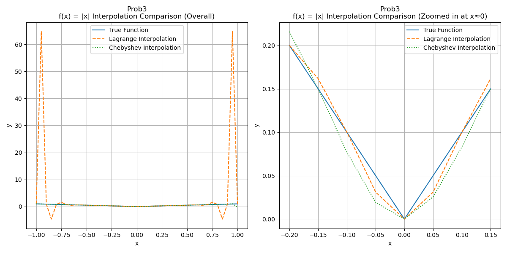
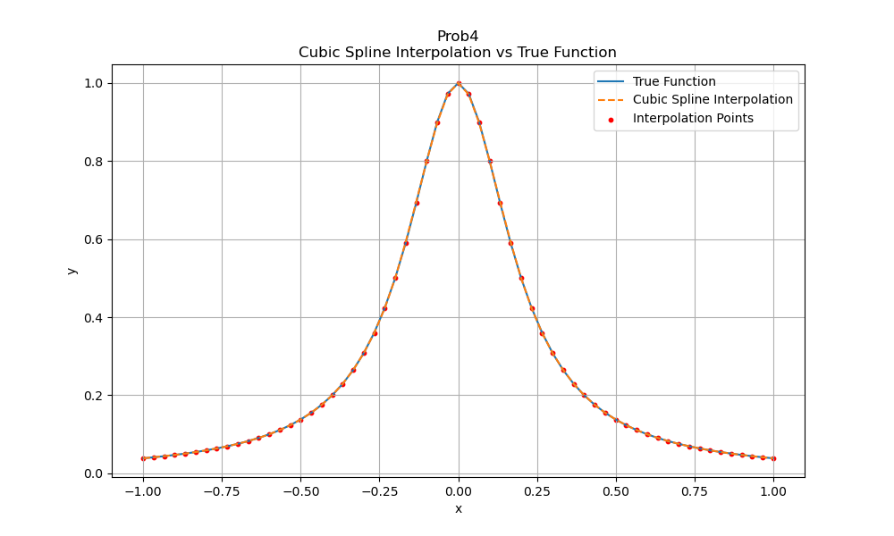
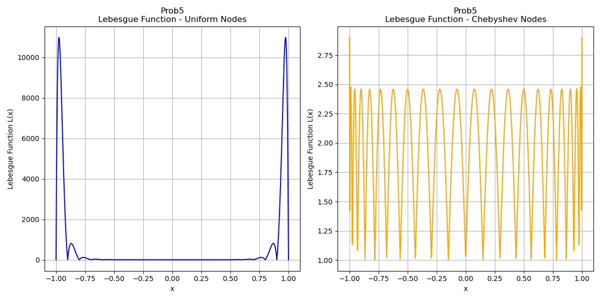

# 计算物理第二次作业

## 第一题

高斯消元法原理见课件。雅可比迭代法求解线性方程组$Ax=b$的核心思想：
$$
x^{(k+1)} = D^{-1}[b - (L + U)x^{(k)}],\quad k=0, 1, 2, \cdots
$$
其中，$A=D+L+U$，$D$是$A$的对角矩阵，$L$是$A$的严格下三角矩阵，$U$是$A$的严格上三角矩阵。

关键代码实现：

```python
for iteration in range(max_iterations):
    x_new = np.zeros(n)
    for i in range(n):
        sum1 = np.dot(A[i, :i], x[:i])  # L部分，即Σ_(j=0)^(i-1) a_ij * x_j
        sum2 = np.dot(A[i, i + 1:], x[i + 1:])  # U部分，即Σ_(j=i+1)^(n-1) a_ij * x_j
        x_new[i] = (b[i] - sum1 - sum2) / A[i, i]  # 迭代公式：x_i^(k+1)=(b_i - Σ_(j≠i) a_ij* x_j^(k)) / a_ii
```

运行得到结果：


## 第二题

### 第一小问

按照题目要求构造即可。关键代码：

```python
# 初始化一个二维数组来存储中间计算结果
phi = np.zeros((n, n))

# 填充 phi 的第一列y_values
for i in range(n):
    phi[i][0] = y_values[i]

# 递推计算 phi 的其他列
for i in range(1, n):  # phi 的行
    for j in range(1, i+1):  # phi 的列
        numerator = x_values[j-1] - x_values[i]
        denominator = phi[j-1][j-1] - phi[i][j-1]
        phi[i][j] = numerator / denominator

# 提取对角线上的值作为结果
result = [phi[i][i] for i in range(1, n)]
```

此代码构造一个矩阵$phi$，形式上满足
$$
phi=\left[
\begin{matrix}
	y_0 & & & \\
	y_1 & \phi(x_0,x_1) & & \\
	y_2 & \phi(x_0,x_2) & \phi(x_0,x_1,x_2) & \\
	y_3 & \phi(x_0,x_3) & \phi(x_0,x_1,x_3) & \phi(x_0,x_1,x_2,x_3) \\
	\cdots
\end{matrix}
\right]
$$
得到的$\phi (x_0,x_1,\cdots,x_n)$结果为


### 第二小问

根据题意，可以画出有理分式插值和拉格朗日多项式插值的图像


得到的结果


从图像以及误差平方和可以看出，有理分式内插法的误差明显小于拉格朗日插值法，说明有理分式内插法在本例中表现更好，能够更准确地逼近函数$tan(x)$的值。

## 第三题

### 第一小问

采用拉格朗日多项式内插法。

| x | f(x) | P20(x) | \|f(x)-P20(x)\| |
|----|--------|-----------|----------------|
| -1.000000 | 0.038462 | 0.038462 | 0.000000e+00 |
| -0.950000 | 0.042440 | -39.952449 | 3.999489e+01 |
| -0.900000 | 0.047059 | 0.047059 | 0.000000e+00 |
| -0.850000 | 0.052459 | 3.454958 | 3.402499e+00 |
| -0.800000 | 0.058824 | 0.058824 | 0.000000e+00 |
| -0.750000 | 0.066390 | -0.447052 | 5.134420e-01 |
| -0.700000 | 0.075472 | 0.075472 | 0.000000e+00 |
| -0.650000 | 0.086486 | 0.202423 | 1.159361e-01 |
| -0.600000 | 0.100000 | 0.100000 | 0.000000e+00 |
| -0.550000 | 0.116788 | 0.080660 | 3.612833e-02 |
| -0.500000 | 0.137931 | 0.137931 | 0.000000e+00 |
| -0.450000 | 0.164948 | 0.179763 | 1.481418e-02 |
| -0.400000 | 0.200000 | 0.200000 | 0.000000e+00 |
| -0.350000 | 0.246154 | 0.238446 | 7.707912e-03 |
| -0.300000 | 0.307692 | 0.307692 | 0.000000e+00 |
| -0.250000 | 0.390244 | 0.395093 | 4.849151e-03 |
| -0.200000 | 0.500000 | 0.500000 | 0.000000e+00 |
| -0.150000 | 0.640000 | 0.636755 | 3.244664e-03 |
| -0.100000 | 0.800000 | 0.800000 | 0.000000e+00 |
| -0.050000 | 0.941176 | 0.942490 | 1.313909e-03 |
| 0.000000 | 1.000000 | 1.000000 | 0.000000e+00 |
| 0.050000 | 0.941176 | 0.942490 | 1.313909e-03 |
| 0.100000 | 0.800000 | 0.800000 | 0.000000e+00 |
| 0.150000 | 0.640000 | 0.636755 | 3.244664e-03 |
| 0.200000 | 0.500000 | 0.500000 | 0.000000e+00 |
| 0.250000 | 0.390244 | 0.395093 | 4.849151e-03 |
| 0.300000 | 0.307692 | 0.307692 | 0.000000e+00 |
| 0.350000 | 0.246154 | 0.238446 | 7.707912e-03 |
| 0.400000 | 0.200000 | 0.200000 | 0.000000e+00 |
| 0.450000 | 0.164948 | 0.179763 | 1.481418e-02 |
| 0.500000 | 0.137931 | 0.137931 | 0.000000e+00 |
| 0.550000 | 0.116788 | 0.080660 | 3.612833e-02 |
| 0.600000 | 0.100000 | 0.100000 | 0.000000e+00 |
| 0.650000 | 0.086486 | 0.202423 | 1.159361e-01 |
| 0.700000 | 0.075472 | 0.075472 | 0.000000e+00 |
| 0.750000 | 0.066390 | -0.447052 | 5.134420e-01 |
| 0.800000 | 0.058824 | 0.058824 | 0.000000e+00 |
| 0.850000 | 0.052459 | 3.454958 | 3.402499e+00 |
| 0.900000 | 0.047059 | 0.047059 | 0.000000e+00 |
| 0.950000 | 0.042440 | -39.952449 | 3.999489e+01 |
| 1.000000 | 0.038462 | 0.038462 | 0.000000e+00 |

插值结果如图所示


可以看到，使用均匀分布节点的拉格朗日插值法在区间端点附近出现了较大的误差，即Runge现象。

### 第二小问

由题，构造Chebyshev多项式，关键代码：

```python
# 计算系数ck
c = []
for k in range(n):
    sum_ck = 0
    for j in range(1, n):
        sum_ck += y_values[j] * np.cos(k * (2 * j + 1) * np.pi / (2 * n))
    ck = (2 / n) * sum_ck
    # 特殊处理c0
    if k == 0:
        ck = ck / 2
        c.append(ck)
```

上述代码计算系数$c_k= \frac{2-\delta_{0k}}{n} \Sigma_{j=0}^{n-1} \cos{(\frac{k\pi(j+1/2)}{n})} f[\cos(\frac{\pi(j+1/2)}{n})]$。

```python
# 计算bk(x)并计算插值结果
results = []
for xi in x:
    b_kplus2 = 0
    b_kplus1 = 0
    for k in range(n - 1, 0, -1):
        b_k = 2 * xi * b_kplus1 - b_kplus2 + c[k]
        b_kplus2 = b_kplus1
        b_kplus1 = b_k
    fx = xi * b_kplus1 - b_kplus2 + c[0]
    results.append(fx)
```

上述代码根据Clenshaw算法计算Chebyshev展开：由于Chebyshev多项式满足
$$
T_{k+1}(x) = 2xT_k(x) - T_{k-1}(x)
$$
构造新函数$b(x)$满足
$$
b_{n+1}(x) = 0, b_{n+2}(x) = 0,\\
b_k(x) = 2xb_{k+1}(x) - b_{k+2}(x) + c_k
$$
迭代，最终得到
$$
f(x) = c_0 + xb_1(x) - b_2(x)
$$
插值结果列表如下：

| x         | f(x)     | Chebyshev P(x) | \|f(x)-P(x)\| |
| :-------- | :------- | :------------- | :------------ |
| 0.997204  | 0.038669 | 0.000000       | 3.866918e-02  |
| 0.986066  | 0.039513 | 0.022382       | 1.713123e-02  |
| 0.974928  | 0.040384 | 0.040384       | 9.714451e-17  |
| 0.952901  | 0.042193 | 0.051335       | 9.141440e-03  |
| 0.930874  | 0.044124 | 0.044124       | 2.012279e-16  |
| 0.898450  | 0.047214 | 0.039339       | 7.875179e-03  |
| 0.866025  | 0.050633 | 0.050633       | 0.000000e+00  |
| 0.823928  | 0.055644 | 0.063477       | 7.833552e-03  |
| 0.781831  | 0.061419 | 0.061419       | 4.024558e-16  |
| 0.731002  | 0.069642 | 0.061293       | 8.349052e-03  |
| 0.680173  | 0.079581 | 0.079581       | 8.326673e-17  |
| 0.621746  | 0.093772 | 0.103117       | 9.344975e-03  |
| 0.563320  | 0.111942 | 0.111942       | 2.081668e-16  |
| 0.498602  | 0.138598 | 0.127674       | 1.092400e-02  |
| 0.433884  | 0.175243 | 0.175243       | 2.498002e-16  |
| 0.364319  | 0.231577 | 0.244798       | 1.322133e-02  |
| 0.294755  | 0.315257 | 0.315257       | 5.551115e-17  |
| 0.221899  | 0.448234 | 0.432724       | 1.551070e-02  |
| 0.149042  | 0.642946 | 0.642946       | 3.330669e-16  |
| 0.074521  | 0.878090 | 0.888328       | 1.023765e-02  |
| 0.000000  | 1.000000 | 1.000000       | 6.661338e-16  |
| -0.074521 | 0.878090 | 0.888050       | 9.960119e-03  |
| -0.149042 | 0.642946 | 0.642946       | 8.881784e-16  |
| -0.221899 | 0.448234 | 0.433014       | 1.522037e-02  |
| -0.294755 | 0.315257 | 0.315257       | 1.665335e-16  |
| -0.364319 | 0.231577 | 0.244480       | 1.290291e-02  |
| -0.433884 | 0.175243 | 0.175243       | 2.775558e-16  |
| -0.498602 | 0.138598 | 0.128042       | 1.055623e-02  |
| -0.563320 | 0.111942 | 0.111942       | 2.636780e-16  |
| -0.621746 | 0.093772 | 0.102666       | 8.893966e-03  |
| -0.680173 | 0.079581 | 0.079581       | 2.775558e-17  |
| -0.731002 | 0.069642 | 0.061889       | 7.753689e-03  |
| -0.781831 | 0.061419 | 0.061419       | 5.412337e-16  |
| -0.823928 | 0.055644 | 0.062611       | 6.967041e-03  |
| -0.866025 | 0.050633 | 0.050633       | 6.661338e-16  |
| -0.898450 | 0.047214 | 0.040794       | 6.419912e-03  |
| -0.930874 | 0.044124 | 0.044124       | 2.012279e-16  |
| -0.952901 | 0.042193 | 0.048214       | 6.020591e-03  |
| -0.974928 | 0.040384 | 0.040384       | 1.804112e-16  |
| -0.986066 | 0.039513 | 0.033973       | 5.539692e-03  |
| -0.997204 | 0.038669 | 0.038669       | 4.857226e-17  |

结果图：


可以看到，Chebyshev 多项式插值法在整个区间上的误差显著小于均匀分布节点的拉格朗日插值法，避免了Runge现象。

### 第三小问

结果列表如下：

| x         | f(x)     | Lagrange P(x) | Chebyshev P(x) | \|f(x)-Lagrange P(x)\| | \|f(x)-Chebyshev P(x)\| |
| :-------- | :------- | :------------ | :------------- | :--------------------- | :---------------------- |
| -1.000000 | 1.000000 | 1.000000      | 0.994674       | 0.000000e+00           | 5.325637e-03            |
| -0.950000 | 0.950000 | 64.706500     | 0.944854       | 6.375650e+01           | 5.145959e-03            |
| -0.900000 | 0.900000 | 0.900000      | 0.905797       | 0.000000e+00           | 5.797395e-03            |
| -0.850000 | 0.850000 | -4.622894     | 0.846295       | 5.472894e+00           | 3.705399e-03            |
| -0.800000 | 0.800000 | 0.800000      | 0.796272       | 0.000000e+00           | 3.728417e-03            |
| -0.750000 | 0.750000 | 1.586376      | 0.755800       | 8.363759e-01           | 5.800001e-03            |
| -0.700000 | 0.700000 | 0.700000      | 0.703867       | 0.000000e+00           | 3.866819e-03            |
| -0.650000 | 0.650000 | 0.457604      | 0.644344       | 1.923961e-01           | 5.656484e-03            |
| -0.600000 | 0.600000 | 0.600000      | 0.593481       | 0.000000e+00           | 6.518838e-03            |
| -0.550000 | 0.550000 | 0.611706      | 0.552841       | 6.170631e-02           | 2.840956e-03            |
| -0.500000 | 0.500000 | 0.500000      | 0.509262       | 0.000000e+00           | 9.261569e-03            |
| -0.450000 | 0.450000 | 0.423458      | 0.453701       | 2.654191e-02           | 3.700935e-03            |
| -0.400000 | 0.400000 | 0.400000      | 0.392249       | 0.000000e+00           | 7.751038e-03            |
| -0.350000 | 0.350000 | 0.365067      | 0.338570       | 1.506700e-02           | 1.142959e-02            |
| -0.300000 | 0.300000 | 0.300000      | 0.298435       | 0.000000e+00           | 1.565072e-03            |
| -0.250000 | 0.250000 | 0.238656      | 0.262824       | 1.134449e-02           | 1.282364e-02            |
| -0.200000 | 0.200000 | 0.200000      | 0.215923       | 0.000000e+00           | 1.592270e-02            |
| -0.150000 | 0.150000 | 0.161763      | 0.150438       | 1.176288e-02           | 4.376785e-04            |
| -0.100000 | 0.100000 | 0.100000      | 0.076921       | 0.000000e+00           | 2.307909e-02            |
| -0.050000 | 0.050000 | 0.031045      | 0.019314       | 1.895460e-02           | 3.068599e-02            |
| 0.000000  | 0.000000 | 0.000000      | -0.000000      | 0.000000e+00           | 1.665335e-15            |
| 0.050000  | 0.050000 | 0.031045      | 0.025505       | 1.895460e-02           | 2.449529e-02            |
| 0.100000  | 0.100000 | 0.100000      | 0.083114       | 0.000000e+00           | 1.688589e-02            |
| 0.150000  | 0.150000 | 0.161763      | 0.150290       | 1.176288e-02           | 2.895668e-04            |
| 0.200000  | 0.200000 | 0.200000      | 0.209359       | 0.000000e+00           | 9.358554e-03            |
| 0.250000  | 0.250000 | 0.238656      | 0.256530       | 1.134449e-02           | 6.529593e-03            |
| 0.300000  | 0.300000 | 0.300000      | 0.299336       | 0.000000e+00           | 6.643323e-04            |
| 0.350000  | 0.350000 | 0.365067      | 0.346209       | 1.506700e-02           | 3.790777e-03            |
| 0.400000  | 0.400000 | 0.400000      | 0.398232       | 0.000000e+00           | 1.768305e-03            |
| 0.450000  | 0.450000 | 0.423458      | 0.450408       | 2.654191e-02           | 4.084611e-04            |
| 0.500000  | 0.500000 | 0.500000      | 0.499754       | 0.000000e+00           | 2.457640e-04            |
| 0.550000  | 0.550000 | 0.611706      | 0.549461       | 6.170631e-02           | 5.385557e-04            |
| 0.600000  | 0.600000 | 0.600000      | 0.602537       | 0.000000e+00           | 2.536942e-03            |
| 0.650000  | 0.650000 | 0.457604      | 0.653630       | 1.923961e-01           | 3.629842e-03            |
| 0.700000  | 0.700000 | 0.700000      | 0.696232       | 0.000000e+00           | 3.768199e-03            |
| 0.750000  | 0.750000 | 1.586376      | 0.741666       | 8.363759e-01           | 8.333525e-03            |
| 0.800000  | 0.800000 | 0.800000      | 0.807934       | 0.000000e+00           | 7.933554e-03            |
| 0.850000  | 0.850000 | -4.622894     | 0.862159       | 5.472894e+00           | 1.215922e-02            |
| 0.900000  | 0.900000 | 0.900000      | 0.867462       | 0.000000e+00           | 3.253813e-02            |
| 0.950000  | 0.950000 | 64.706500     | 1.016200       | 6.375650e+01           | 6.619981e-02            |
| 1.000000  | 1.000000 | 1.000000      | -0.272636      | 0.000000e+00           | 1.272636e+00            |

结果图如下：



对于$f(x) = |x|$，在$x ≈ 0$附近，均匀分布节点的拉格朗日插值法表现出较大的误差，而Chebyshev插值法则表现较好，但仍然存在一定的误差。这是因为$f(x)$在$x=0$处不可导，导致插值多项式难以准确逼近该点的行为。

### 第四小问

结果列表如下：

| x         | f(x)     | Spline P(x) | \|f(x)-P(x)\| |
| :-------- | :------- | :---------- | :------------ |
| -1.000000 | 0.038462 | 0.038462    | 0.000000e+00  |
| -0.966667 | 0.041049 | 0.041149    | 9.972946e-05  |
| -0.933333 | 0.043902 | 0.043970    | 6.744793e-05  |
| -0.900000 | 0.047059 | 0.047059    | 0.000000e+00  |
| -0.866667 | 0.050562 | 0.050533    | 2.891591e-05  |
| -0.833333 | 0.054463 | 0.054443    | 1.993336e-05  |
| -0.800000 | 0.058824 | 0.058824    | 0.000000e+00  |
| -0.766667 | 0.063717 | 0.063721    | 4.615228e-06  |
| -0.733333 | 0.069231 | 0.069234    | 3.366009e-06  |
| -0.700000 | 0.075472 | 0.075472    | 0.000000e+00  |
| -0.666667 | 0.082569 | 0.082558    | 1.108412e-05  |
| -0.633333 | 0.090680 | 0.090670    | 1.006875e-05  |
| -0.600000 | 0.100000 | 0.100000    | 0.000000e+00  |
| -0.566667 | 0.110769 | 0.110766    | 3.508784e-06  |
| -0.533333 | 0.123288 | 0.123292    | 4.498551e-06  |
| -0.500000 | 0.137931 | 0.137931    | 0.000000e+00  |
| -0.466667 | 0.155172 | 0.155107    | 6.577851e-05  |
| -0.433333 | 0.175610 | 0.175534    | 7.595224e-05  |
| -0.400000 | 0.200000 | 0.200000    | 2.775558e-17  |
| -0.366667 | 0.229299 | 0.229374    | 7.424473e-05  |
| -0.333333 | 0.264706 | 0.264847    | 1.408261e-04  |
| -0.300000 | 0.307692 | 0.307692    | 0.000000e+00  |
| -0.266667 | 0.360000 | 0.359435    | 5.645206e-04  |
| -0.233333 | 0.423529 | 0.422610    | 9.198404e-04  |
| -0.200000 | 0.500000 | 0.500000    | 0.000000e+00  |
| -0.166667 | 0.590164 | 0.592714    | 2.549600e-03  |
| -0.133333 | 0.692308 | 0.695142    | 2.834664e-03  |
| -0.100000 | 0.800000 | 0.800000    | 0.000000e+00  |
| -0.066667 | 0.900000 | 0.897916    | 2.084489e-03  |
| -0.033333 | 0.972973 | 0.971180    | 1.792995e-03  |
| 0.000000  | 1.000000 | 1.000000    | 0.000000e+00  |
| 0.033333  | 0.972973 | 0.971180    | 1.792995e-03  |
| 0.066667  | 0.900000 | 0.897916    | 2.084489e-03  |
| 0.100000  | 0.800000 | 0.800000    | 0.000000e+00  |
| 0.133333  | 0.692308 | 0.695142    | 2.834664e-03  |
| 0.166667  | 0.590164 | 0.592714    | 2.549600e-03  |
| 0.200000  | 0.500000 | 0.500000    | 1.110223e-16  |
| 0.233333  | 0.423529 | 0.422610    | 9.198404e-04  |
| 0.266667  | 0.360000 | 0.359435    | 5.645206e-04  |
| 0.300000  | 0.307692 | 0.307692    | 5.551115e-17  |
| 0.333333  | 0.264706 | 0.264847    | 1.408261e-04  |
| 0.366667  | 0.229299 | 0.229374    | 7.424473e-05  |
| 0.400000  | 0.200000 | 0.200000    | 2.775558e-17  |
| 0.433333  | 0.175610 | 0.175534    | 7.595224e-05  |
| 0.466667  | 0.155172 | 0.155107    | 6.577851e-05  |
| 0.500000  | 0.137931 | 0.137931    | 0.000000e+00  |
| 0.533333  | 0.123288 | 0.123292    | 4.498551e-06  |
| 0.566667  | 0.110769 | 0.110766    | 3.508784e-06  |
| 0.600000  | 0.100000 | 0.100000    | 1.387779e-17  |
| 0.633333  | 0.090680 | 0.090670    | 1.006875e-05  |
| 0.666667  | 0.082569 | 0.082558    | 1.108412e-05  |
| 0.700000  | 0.075472 | 0.075472    | 1.387779e-17  |
| 0.733333  | 0.069231 | 0.069234    | 3.366009e-06  |
| 0.766667  | 0.063717 | 0.063721    | 4.615228e-06  |
| 0.800000  | 0.058824 | 0.058824    | 0.000000e+00  |
| 0.833333  | 0.054463 | 0.054443    | 1.993336e-05  |
| 0.866667  | 0.050562 | 0.050533    | 2.891591e-05  |
| 0.900000  | 0.047059 | 0.047059    | 0.000000e+00  |
| 0.933333  | 0.043902 | 0.043970    | 6.744793e-05  |
| 0.966667  | 0.041049 | 0.041149    | 9.972946e-05  |
| 1.000000  | 0.038462 | 0.038462    | 0.000000e+00  |

结果图如下：



三次样条插值法在整个区间上表现出良好的逼近效果，误差很小，效果好于Chebyshev多项式和拉格朗日多项式，且没有出现Runge现象。这是因为样条函数在每个子区间上都是低阶多项式，能够更好地适应函数的局部变化。

### 第五小问

分布曲线如下所示：



Lebesgue 数衡量了插值过程中的误差放大效应。对于均匀分布节点，Lebesgue 数在区间端点附近显著增大，表明误差可能被放大，导致Runge现象的出现。而Chebyshev节点的Lebesgue数相对较小且分布更均匀，说明其插值过程中的误差放大效应较小，更稳定。因此，选择合适的插值节点对于控制插值误差至关重要。

Lebesgue 数确实存在下限，且对于任意节点分布，其Lebesgue 数的下限均大于等于1。这是因为在插值过程中，至少会有一个基函数在某些点处取值为1。例如对于基函数$L_i(x)$，当$x=x_i$时，$L_i(x_i)=1$，则Lebesgue函数$\Lambda(x)=\Sigma_i |L_i(x)|$在该点处至少为1。因此Lebesgue数有下限，且至少为1。

## 第四题

### 第一小问

计算得到的值如下：

| $t$  | $x_t=r(\phi)\cos\phi$             | $y_t=r(\phi)\cos\phi$             |
| ---- | --------------------------------- | --------------------------------- |
| 0    | 0                                 | 0                                 |
| 1    | $\frac{\sqrt{2}}{2}-\frac{1}{2}$  | $\frac{\sqrt{2}}{2}-\frac{1}{2}$  |
| 2    | 0                                 | 1                                 |
| 3    | $-\frac{\sqrt{2}}{2}-\frac{1}{2}$ | $\frac{\sqrt{2}}{2}+\frac{1}{2}$  |
| 4    | -2                                | 0                                 |
| 5    | $-\frac{\sqrt{2}}{2}-\frac{1}{2}$ | $-\frac{\sqrt{2}}{2}-\frac{1}{2}$ |
| 6    | 0                                 | -1                                |
| 7    | $\frac{\sqrt{2}}{2}-\frac{1}{2}$  | $-\frac{\sqrt{2}}{2}+\frac{1}{2}$ |
| 8    | 0                                 | 0                                 |

### 第二小问

函数中的小数保留6位有效数字：

$$ S_\Delta(X; t) =
\begin{cases}
t \cdot (0.245602 - 0.038495t^2) &, \quad t \in [0, 1] \\
-0.221738t^3 + 0.54973t^2 - 0.304128t + 0.183243 &, \quad t \in [1, 2] \\
0.339662t^3 - 2.81867t^2 + 6.43268t - 4.30796 &, \quad t \in [2, 3] \\
0.277304t^3 - 2.25745t^2 + 4.749t - 2.62428 &, \quad t \in [3, 4] \\
-0.277304t^3 + 4.39784t^2 - 21.8721t + 32.8706 &, \quad t \in [4, 5] \\
-0.339662t^3 + 5.33322t^2 - 26.549t + 40.6654 &, \quad t \in [5, 6] \\
0.221738t^3 - 4.77199t^2 + 34.0822t - 80.5971 &, \quad t \in [6, 7] \\
-0.245602t + 19.7095 \cdot (0.125t - 1)^3 + 1.96481 &, \quad t \in [7, 8]
\end{cases} $$

$$ S_\Delta(Y; t) =
\begin{cases}
t \cdot (0.173495t^2 + 0.0336116) &, \quad t \in [0, 1] \\
-0.281689t^3 + 1.36555t^2 - 1.33194t + 0.455185 &, \quad t \in [1, 2] \\
-0.218311t^3 + 0.985281t^2 - 0.571398t - 0.051845 &, \quad t \in [2, 3] \\
0.326505t^3 - 3.91806t^2 + 14.1386t - 14.7619 &, \quad t \in [3, 4] \\
0.326505t^3 - 3.91806t^2 + 14.1386t - 14.7619 &, \quad t \in [4, 5] \\
-0.218311t^3 + 4.25417t^2 - 26.7225t + 53.3401 &, \quad t \in [5, 6] \\
-0.281689t^3 + 5.39499t^2 - 33.5674t + 67.0299 &, \quad t \in [6, 7] \\
0.0336116t + 88.8295 \cdot (0.125t - 1)^3 - 0.268893 &, \quad t \in [7, 8]
\end{cases} $$

### 第三小问

如下图：


### 第四小问

三次样条插值通过在每个相邻数据点之间构造三次多项式，并确保这些多项式在数据点处连续且具有连续的一阶和二阶导数，从而实现了平滑连接。这种方法不仅保证了曲线通过所有给定点，还确保了曲线的光滑性，避免了不连续或尖锐的转折。

## 第五题

### 第一小问&第二小问

根据加权最小二乘法的计算原理，假设拟合多项式为$$y(x) = a_0 + a_1 x + a_2 x^2 + \dots + a_m x^m$$，目标是最小化加权残差平方和$$\chi^2 = \sum_{i=1}^{n} \left( \frac{y_i - y(x_i)}{\sigma_i} \right)^2$$。

对每个系数$a_j$求偏导并令其为零：$\frac{\partial \chi^2}{\partial a_j} = 0, \quad j = 0, 1, \dots, m$

得到线性方程组：
$$
\sum_{k=0}^{m} \left( \sum_{i=1}^{n} \frac{x_i^{j+k}}{\sigma_i^2} \right) a_k = \sum_{i=1}^{n} \frac{y_i x_i^j}{\sigma_i^2}
$$

用矩阵形式表示为：
$$
\mathbf{M} \cdot \mathbf{a} = \mathbf{b}
$$

其中，

- $\mathbf{M}$ 是 $(m+1) \times (m+1)$ 矩阵，$M[j][k] = \sum \frac{x_i^{j+k}}{\sigma_i^2}$

- $\mathbf{a}$ 是系数向量 $[a_0, a_1, \dots, a_m]^T$
- $\mathbf{b}$ 是向量，$b[j] = \sum \frac{y_i x_i^j}{\sigma_i^2}$

解出$a$即可得到系数。系数的误差由协方差矩阵给出，协方差矩阵$\mathbf{C} = \mathbf{M}^{-1}$，系数$a_j$的误差为协方差矩阵对角线元素的平方根：$\sigma_{a_j} = \sqrt{C[j][j]}$

因此需要用到求解线性方程组、矩阵求逆两种算法。前者在第一题中已实现，下面实现矩阵求逆。

#### 矩阵求逆

由于矩阵$M$是实对称矩阵，因此可以应用Cholesky分解，将其分解为下三角矩阵$L$和上三角矩阵$L^T$的乘积：$M=LL^T$。

因此$LL^TM^{-1}=LY=I$，其中$Y=L^TM^{-1}$，$I$为单位矩阵。求解$LY=I$得到$Y$，再求解$L^TX=Y$，即得到$X=M^{-1}$。

Cholesky分解核心代码：

```python
for i in range(n):
    for j in range(i + 1):
        # 计算对角线元素（i == j）
        if i == j:
            # L[i,i] = sqrt(M[i,i] - sum(L[i,k]^2 for k=0..i-1))
            sum_sq = np.sum(L[i, :i] ** 2)
            diag_val = M[i, i] - sum_sq
            if diag_val < eps:  # 若被开方数非正，矩阵非正定
                raise ValueError("矩阵非正定，无法进行 Cholesky 分解")
            L[i, i] = np.sqrt(diag_val)
        # 计算非对角线元素（i > j）
        else:
            # L[i,j] = (M[i,j] - sum(L[i,k]·L[j,k] for k=0..j-1)) / L[j,j]
            sum_prod = np.sum(L[i, :j] * L[j, :j])
            L[i, j] = (M[i, j] - sum_prod) / L[j, j]
```

求逆核心代码：

```python
# 1. Cholesky分解
L = cholesky(M)
LT = L.T  # L的转置

# 2. 求解L·Y = I，得到Y（每列对应单位矩阵的一列）
Y = np.zeros((n, n))
for j in range(n):
    e_j = np.zeros(n)
    e_j[j] = 1.0  # 单位向量（第j个元素为1）
    Y[:, j] = forward_substitution(L, e_j)  # 解第j列方程

# 3. 求解LT·X = Y，得到X = M^{-1}
M_inv = np.zeros((n, n))
for j in range(n):
    M_inv[:, j] = backward_substitution(LT, Y[:, j])  # 解第j列方程
```

#### 结果

1次多项式拟合结果:
$$
a_0 = -1.469123 ± 0.088936\\
a_1 = 3.639348 ± 0.015647
$$

2次多项式拟合结果:
$$
a_0 = 1.247523 ± 0.108119\\
a_1 = 1.074951 ± 0.060110\\
a_2 = 0.274752 ± 0.006218
$$

3次多项式拟合结果:
$$
a_0 = 1.202997 ± 0.117696\\
a_1 = 1.218518 ± 0.161550\\
a_2 = 0.229641 ± 0.047526\\
a_3 = 0.003321 ± 0.003468
$$

如下图所示：


