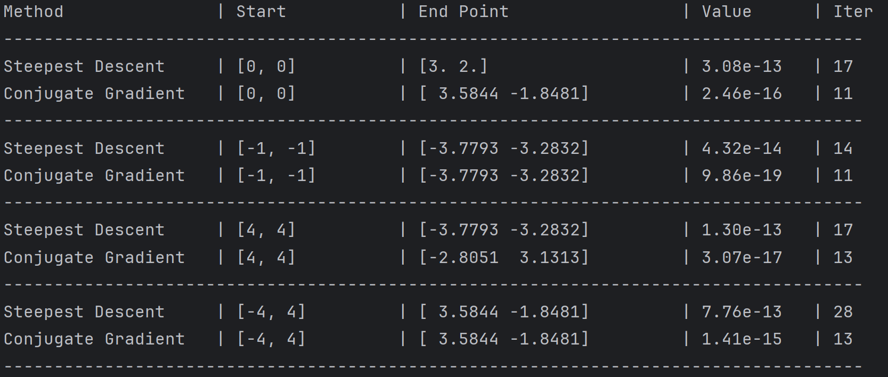
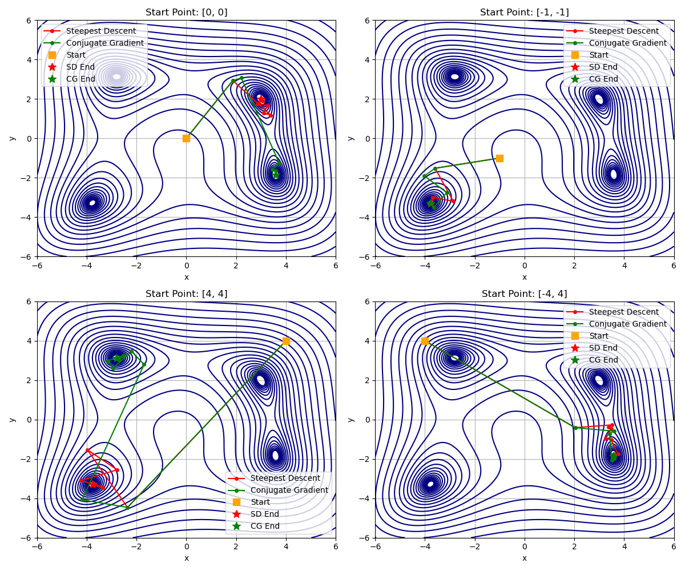

# 计算物理第三次作业

## 第一题

利用上次作业编写的Chebyshev近似函数即可：

```python
# 生成 Chebyshev 节点
def Chebyshev_nodes(a, b, n):
    nodes = []
    for k in range(n):
        x_k = 0.5 * (a + b) + 0.5 * (b - a) * np.cos((2 * k + 1) * np.pi / (2 * n))
        nodes.append(x_k)
    return nodes


# Chebyshev 多项式插值
def Chebyshev_poly_interpolation(f, a, b, n, x):
    # 生成 Chebyshev 节点
    nodes = Chebyshev_nodes(a, b, n)

    # 计算节点处的函数值
    y_values = [f(xi) for xi in nodes]

    # 使用Clenshaw算法计算Chebyshev展开
    c = []
    for k in range(n):
        sum_ck = 0
        for j in range(0, n):
            sum_ck += y_values[j] * np.cos(k * (2 * j + 1) * np.pi / (2 * n))
        ck = (2 / n) * sum_ck
        # 特殊处理c0
        if k == 0:
            ck = ck / 2
        c.append(ck)

    # 计算bk(x)并计算插值结果
    results = []
    for xi in x:
        b_kplus2 = 0
        b_kplus1 = 0
        for k in range(n - 1, 0, -1):
            b_k = 2 * xi * b_kplus1 - b_kplus2 + c[k]
            b_kplus2 = b_kplus1
            b_kplus1 = b_k
        fx = xi * b_kplus1 - b_kplus2 + c[0]
        results.append(fx)
    return results
```

需要注意的是，要把区间$[2, 5]$上的点映射到$[-1, 1]$内：

```python
x_mapped = (2 * x_vals - (a + b)) / (b - a)  # 映射到 [-1, 1]
```

结果如下：


可以看到，随着节点数增多，近似效果越来越好，在n=15时就已经与原函数相差非常小了。

## 第二题

使用复用的梯形法则、Simpson法则和Gauss-Legendre法则：

```python
# 梯形法则
def trapezoidal_rule(func, a, b, n):
    x = np.linspace(a, b, n)
    y = func(x)
    h = (b - a) / (n - 1)
    integral = (h / 2) * (y[0] + 2 * np.sum(y[1:n-1]) + y[n-1])
    return integral

# 辛普森法则
def simpsons_rule(func, a, b, n):
    n = 2*n+1  # 题目表述不清楚，实际上是这个意思
    x = np.linspace(a, b, n)
    y = func(x)
    h = (b - a) / (n - 1)
    integral = (h / 3) * (y[0] + 4 * np.sum(y[1:n-1:2]) + 2 * np.sum(y[2:n-2:2]) + y[n-1])
    return integral

# Gauss-Legendre 方法
def gauss_legendre_rule(func, a, b, n):
    [nodes, weights] = roots_legendre(n)
    # 变换节点到 [a, b]
    nodes = 0.5 * (b - a) * nodes + 0.5 * (a + b)
    weights = 0.5 * (b - a) * weights
    integral = np.sum(weights * func(nodes))
    return integral
```

其中，Gauss-Legendre法则的原理如下：

我们希望用有限个点值来近似定积分
$$
I=\int_a^b f(t)\,dt
$$
Gauss–Legendre 的思想是：在标准区间 $[-1,1]$ 上选择最优的 $n$ 个取样点 $x_i$ 和对应权重 $w_i$，使得对尽可能高阶多项式积分都能得到精确值。这种选择使得用 $n$ 个点能精确积分次数最多（达到 $2n-1$ 次多项式），比等距点的 Newton-Cotes 方法更高效。

把积分先变换到标准区间 $[-1,1]$，Gauss–Legendre 的近似形式为
$$
\int_{-1}^{1} f(x)\,dx \approx \sum_{i=1}^n w_i\, f(x_i),
$$
其中：

- $x_i$ 是第 $n$ 阶 Legendre 多项式 $P_n(x)$ 的 $n$ 个实根（都在 $(-1,1)$ 内），
- 对应的权重为

$$
w_i=\frac{2}{\bigl(1-x_i^2\bigr)\,[P'_n(x_i)]^2}.
$$

把 $[-1,1]$ 上的节点 $x_i$ 映射到 $[a,b]$：
$$
t_i=\frac{b+a}{2}+\frac{b-a}{2}x_i,
$$
并且积分变换系数 $(b-a)/2$，于是
$$
\int_a^b f(t)\,dt \approx \frac{b-a}{2}\sum_{i=1}^n w_i\, f\!\left(\frac{b+a}{2}+\frac{b-a}{2}x_i\right).
$$
实现步骤如下：

1. 在标准区间用现成函数（如 `scipy.special.roots_legendre(n)`）得到 $\{x_i,w_i\}$。

2. 把节点映射到 $[a, b]$： $t_i = (a+b)/2 + (b-a)/2 \cdot x_i$。

3. 计算和： $I \approx \frac{b-a}{2}\sum_{i=1}^n w_i f(t_i)$。

结果如下：


可以看到，Gauss-Legendre方法的效果最好，很快收敛到精确值 $E_1(1)-E_{1}(100)$ 附近，其中 $E_n(z)$ 为指数积分函数。

## 第三题

### 第一问

和上一题一样，采用复化的Simpson积分方法：

```python
def simpsons_integral(func, a, b, n, k):
    n = 2*n + 1  # 题目表述不清楚，实际上是这个意思
    x = np.linspace(a, b, n)
    y = func(x, k)
    h = (b - a) / (n - 1)
    integral = (h / 3) * (y[0] + 4 * np.sum(y[1:n-1:2]) + 2 * np.sum(y[2:n-2:2]) + y[n-1])
    return integral
```

不同之处是多了个参数$k$。结果如下：

| k     | N     | Numerical         | Exact             | Error            |
| :---- | :---- | :---------------- | :---------------- | :--------------- |
| 1e+03 | 1e+01 | -3.9072194330e-01 | 2.2482180860e-03  | 3.9297016138e-01 |
| 1e+03 | 1e+02 | -8.9137458193e-03 | 2.2482180860e-03  | 1.1161963905e-02 |
| 1e+03 | 1e+03 | 2.2490218061e-03  | 2.2482180860e-03  | 8.0372015069e-07 |
| 1e+03 | 1e+04 | 2.2482181640e-03  | 2.2482180860e-03  | 7.8013400427e-11 |
| 1e+03 | 1e+05 | 2.2482180860e-03  | 2.2482180860e-03  | 7.9359262217e-15 |
| 1e+04 | 1e+02 | 1.4368649014e-02  | -8.3110485418e-05 | 1.4451759499e-02 |
| 1e+04 | 1e+03 | 3.2922491917e-04  | -8.3110485418e-05 | 4.1233540459e-04 |
| 1e+04 | 1e+04 | -8.3140173083e-05 | -8.3110485418e-05 | 2.9687665112e-08 |
| 1e+04 | 1e+05 | -8.3110488300e-05 | -8.3110485418e-05 | 2.8819559315e-12 |
| 1e+04 | 1e+06 | -8.3110485418e-05 | -8.3110485418e-05 | 1.5394315597e-16 |
| 1e+05 | 1e+03 | -1.9620252974e-04 | 9.7138142464e-07  | 1.9717391117e-04 |
| 1e+05 | 1e+04 | -3.8623019037e-06 | 9.7138142464e-07  | 4.8336833283e-06 |
| 1e+05 | 1e+05 | 9.7172955815e-07  | 9.7138142464e-07  | 3.4813351189e-10 |
| 1e+05 | 1e+06 | 9.7138145875e-07  | 9.7138142464e-07  | 3.4117730080e-14 |
| 1e+05 | 1e+07 | 9.7138142471e-07  | 9.7138142464e-07  | 7.3977528273e-17 |
| 1e+06 | 1e+04 | 1.7923945710e-04  | -9.5137943067e-07 | 1.8019083653e-04 |
| 1e+06 | 1e+05 | 3.7761852167e-06  | -9.5137943067e-07 | 4.7275646474e-06 |
| 1e+06 | 1e+06 | -9.5171986913e-07 | -9.5137943067e-07 | 3.4043845152e-10 |
| 1e+06 | 1e+07 | -9.5137946371e-07 | -9.5137943067e-07 | 3.3031456171e-14 |
| 1e+06 | 1e+08 | -9.5137943058e-07 | -9.5137943067e-07 | 9.1214860507e-17 |

可视化相对误差如下：


可以看到，随着$\alpha$增大，积分相对误差越来越小。即剖分点数量$N$相对于$k$越大，积分效果越好。

### 第二问

对于 $k≠0$ 的情况，先用和角公式
$$
\cos[k(x_0+t)]=\cos(kx_0)\cos(kt)-\sin(kx_0)\sin(kt),
$$
因此
$$
I_{\rm Filon}=\cos(kx_0)\int_{-h}^h (A+Bt+Ct^2)\cos(kt)\,dt
      -\sin(kx_0)\int_{-h}^h (A+Bt+Ct^2)\sin(kt)\,dt.
$$
利用奇偶性：$\cos(kt)$ 为偶，$\sin(kt)$ 为奇，故

$$
\int_{-h}^h Bt\cos(kt)\,dt=0,\quad \int_{-h}^h A\sin(kt)\,dt=0,\quad \int_{-h}^h Ct^2\sin(kt)\,dt=0
$$
于是只剩下两个非零项

$$
I_{\rm Filon} =\cos(kx_0)\Big[2A\int_0^h\cos(kt)\,dt + 2C\int_0^h t^2\cos(kt)\,dt\Big]-\sin(kx_0)\Big[2B\int_0^h t\sin(kt)\,dt\Big].
$$

计算不定积分得到
$$
\boxed{%
\begin{aligned}
I_{\rm Filon}={}&2\cos(kx_0)\Big[\;A\frac{\sin(kh)}{k}
+ C\Big(\frac{h^2\sin(kh)}{k}+\frac{2h\cos(kh)}{k^2}-\frac{2\sin(kh)}{k^3}\Big)\Big]\\
&\;{}+2B\sin(kx_0)\Big(\frac{h\cos(kh)}{k}-\frac{\sin(kh)}{k^2}\Big).
\end{aligned}
}
$$
若 $k=0$ ，直接积分得 $I_{\rm Filon}|_{k=0}=\int_{-h}^h (A+Bt+Ct^2)\,dt=2Ah+\tfrac{2}{3}Ch^3$。

### 第三问

对于$k≠0$，不妨将积分改写为
$$
I_{\text{Filon}}=\cos(kx_0)\big(A I_0 + C I_2\big) - \sin(kx_0)\big(B J_1\big),
$$
其中三个基本矩为（对 $k\neq0$）：
$$
I_0=\int_{-h}^{h}\cos(kt)\,dt=\frac{2\sin(kh)}{k},\\[6pt]
I_2=∫_{−h}^ht^2\cos(kt)\,dt=\frac{2[h^2k^2\sin(kh)+2hk\cos(kh)−2\sin(kh)]}{k^3}, \\[6pt]
J_1=∫_{−h}^ht\sin(kt)\,dt=\frac{2(−hk\cos(kh)+\sin(kh))}{k^2}.
$$
因此在每个小区间上只需求出以区间中心为基准的三点二次插值系数 $A,B,C$，再代入上式即可。

以中心点 $x_{2j+1}$ 为坐标原点，定义
$$
t = x - x_{2j+1}
$$
此时插值多项式写成
$$
p(t)=A + B t + C t^2
$$
满足
$$
p(-h)=e^{x_{2j}},\quad p(0)=e^{x_{2j+1}},\quad p(h)=e^{x_{2j+2}}.
$$
则可以得到方程组
$$
\begin{cases}
A - Bh + C h^2 = e^{x_{2j}},\\[4pt]
A = e^{x_{2j+1}},\\[4pt]
A + Bh + C h^2 = e^{x_{2j+2}}.
\end{cases}
$$
解出唯一的 $A,B,C$：
$$
\begin{cases}
A = e^{x_{2j+1}},\\[6pt]
B = \frac{e^{x_{2j+2}}-e^{x_{2j}}}{2h},\\[6pt]
C = \frac{e^{x_{2j}}+e^{x_{2j+2}}-2e^{x_{2j+1}}}{2h^2}
\end{cases}
$$
代码如下：

```python
def I0_I2_J1(k, h):
	"""
    计算积分 I0, I2, J1
    """
    kh = k * h
    if k == 0:
        I0 = 2.0 * h
        I2 = 2.0 * h**3 / 3.0
        J1 = 0.0
    else:
        I0 = 2.0 * np.sin(kh) / k
        I2 = 2.0 * (h**2 * k**2 * np.sin(kh) + 2.0 * h * k * np.cos(kh) - 2.0 * np.sin(kh)) / (k**3)
        J1 = 2.0 * (-h * k * np.cos(kh) + np.sin(kh)) / (k**2)
    return I0, I2, J1

def composite_filon_exp_cos_vectorized(k, N):
    """
    使用 Filon 方法计算积分 ∫[0,1] exp(x) * cos(kx) dx
    """
    h = 1.0 / (2.0 * N)
    # 中心点 x_mid = (2j+1)*h, j=0..N-1
    j = np.arange(N, dtype=np.float64)
    x_mid = (2.0 * j + 1.0) * h

    # 三点的函数值
    y0 = np.exp(x_mid - h)   # left
    y1 = np.exp(x_mid)       # mid
    y2 = np.exp(x_mid + h)   # right

    # 解出 A,B,C
    A = y1
    B = (y2 - y0) / (2.0 * h)
    C = (y0 + y2 - 2.0 * y1) / (2.0 * h * h)

    # 计算积分 I0, I2, J1
    I0, I2, J1 = I0_I2_J1(k, h)

    # 计算最终结果
    cos_kxm = np.cos(k * x_mid)
    sin_kxm = np.sin(k * x_mid)
    block_vals = cos_kxm * (A * I0 + C * I2) - sin_kxm * (B * J1)
    total = np.sum(block_vals)
    return total
```

结果如下：

| k     | N     | Numerical         | Exact             | Error            |
| :---- | :---- | :---------------- | :---------------- | :--------------- |
| 1e+03 | 1e+01 | 2.2482175773e-03  | 2.2482180860e-03  | 5.0867936556e-10 |
| 1e+03 | 1e+02 | 2.2482180829e-03  | 2.2482180860e-03  | 3.0901305820e-12 |
| 1e+03 | 1e+03 | 2.2482180860e-03  | 2.2482180860e-03  | 1.1110903864e-15 |
| 1e+03 | 1e+04 | 2.2482180860e-03  | 2.2482180860e-03  | 7.1991024253e-16 |
| 1e+03 | 1e+05 | 2.2482180860e-03  | 2.2482180860e-03  | 1.3270634591e-16 |
| 1e+04 | 1e+02 | -8.3110485184e-05 | -8.3110485418e-05 | 2.3383141398e-13 |
| 1e+04 | 1e+03 | -8.3110485417e-05 | -8.3110485418e-05 | 1.6717448823e-15 |
| 1e+04 | 1e+04 | -8.3110485419e-05 | -8.3110485418e-05 | 9.1209863013e-16 |
| 1e+04 | 1e+05 | -8.3110485419e-05 | -8.3110485418e-05 | 2.7531958918e-16 |
| 1e+04 | 1e+06 | -8.3110485418e-05 | -8.3110485418e-05 | 1.4361613027e-16 |
| 1e+05 | 1e+03 | 9.7138142496e-07  | 9.7138142464e-07  | 3.2242351489e-16 |
| 1e+05 | 1e+04 | 9.7138142462e-07  | 9.7138142464e-07  | 1.6426933463e-17 |
| 1e+05 | 1e+05 | 9.7138142424e-07  | 9.7138142464e-07  | 3.9754093775e-16 |
| 1e+05 | 1e+06 | 9.7138142493e-07  | 9.7138142464e-07  | 2.9557934672e-16 |
| 1e+05 | 1e+07 | 9.7138142461e-07  | 9.7138142464e-07  | 2.8908810973e-17 |
| 1e+06 | 1e+04 | -9.5137942970e-07 | -9.5137943067e-07 | 9.7830865452e-16 |
| 1e+06 | 1e+05 | -9.5137943233e-07 | -9.5137943067e-07 | 1.6567367290e-15 |
| 1e+06 | 1e+06 | -9.5137943036e-07 | -9.5137943067e-07 | 3.1624906822e-16 |
| 1e+06 | 1e+07 | -9.5137943063e-07 | -9.5137943067e-07 | 4.4509887312e-17 |
| 1e+06 | 1e+08 | -9.5137943057e-07 | -9.5137943067e-07 | 9.9587781191e-17 |


可以看到，此时的数值积分具有快速的收敛速度和高精度的结果，即使在 $\alpha=10^{-2}$ 的情形下收敛性就已经很好了；随着k和N的增大，数值积分与精确值的误差接近双精度浮点数的机器精度，说明误差极小。

## 第四题

### 第一问

三种方法的数学原理见课件，代码思路与数学原理一致。实现如下：

```python
# 二分法
def bisection(func, a, b, tol=1e-5, max_iter=100):
    results = []
    results.append({'iter': 0, 'a': a, 'b': b, 'x': np.nan, 'err': np.nan})
    
    if func(a) * func(b) > 0:
        return results, False

    for i in range(1, max_iter + 1):
        c = (a + b) / 2
        err = (b - a) / 2  # 区间长度表示精度
        
        # Store the state BEFORE update (the interval used for this step)
        results.append({'iter': i, 'a': a, 'b': b, 'x': c, 'err': err})
        
        # Update interval
        if func(c) == 0:
            a = c
            b = c
        elif func(a) * func(c) < 0:
            b = c
        else:
            a = c
        
        if err < tol:
            break
            
    return results, True

# 牛顿法
def newton(func, dfunc, x0, tol=1e-5, max_iter=100):
    results = []
    x = x0
    results.append({'iter': 0, 'x': x, 'err': np.nan})
    
    for i in range(1, max_iter + 1):
        fx = func(x)
        dfx = dfunc(x)
        if dfx == 0:
            break
        
        x_new = x - fx / dfx
        err = abs(x_new - x)  # 两次迭代x值之差表示精度
        x = x_new
        results.append({'iter': i, 'x': x, 'err': err})
        
        if err < tol:
            break
            
    return results

# 割线法
def secant(func, x0, x1, tol=1e-5, max_iter=100):
    results = []
    results.append({'iter': 0, 'x': x0, 'err': np.nan})
    results.append({'iter': 1, 'x': x1, 'err': abs(x1 - x0)}) 
    
    x_prev = x0
    x_curr = x1
    
    for i in range(2, max_iter + 1):
        fx_curr = func(x_curr)
        fx_prev = func(x_prev)
        
        if fx_curr == fx_prev:
            break
            
        x_new = x_curr - fx_curr * (x_curr - x_prev) / (fx_curr - fx_prev)
        err = abs(x_new - x_curr)  # 两次迭代x值之差表示精度
        
        x_prev = x_curr
        x_curr = x_new
        
        results.append({'iter': i, 'x': x_curr, 'err': err})
        
        if err < tol:
            break
            
    return results
```

二分法采用区间长度来表示精度，牛顿法和割线法采用两次迭代的x值之差表示精度。结果如下：

| Iter | Bisection [a, b]   | Newton x | Secant x |
| :--- | :----------------- | :------- | :------- |
| 0    | [1.50000, 2.00000] | 1.500000 | 1.500000 |
| 1    | [1.50000, 2.00000] | 2.076558 | 2.076558 |
| 2    | [1.75000, 2.00000] | 1.910507 | 1.847217 |
| 3    | [1.87500, 2.00000] | 1.895622 | 1.890869 |
| 4    | [1.87500, 1.93750] | 1.895494 | 1.895628 |
| 5    | [1.87500, 1.90625] | 1.895494 | 1.895494 |
| 6    | [1.89062, 1.90625] |          | 1.895494 |
| 7    | [1.89062, 1.89844] |          |          |
| 8    | [1.89453, 1.89844] |          |          |
| 9    | [1.89453, 1.89648] |          |          |
| 10   | [1.89453, 1.89551] |          |          |
| 11   | [1.89502, 1.89551] |          |          |
| 12   | [1.89526, 1.89551] |          |          |
| 13   | [1.89539, 1.89551] |          |          |
| 14   | [1.89545, 1.89551] |          |          |
| 15   | [1.89548, 1.89551] |          |          |
| 16   | [1.89549, 1.89551] |          |          |

其中，二分法的区间指的是该次迭代**开始前**的区间，而牛顿法和割线法的值则是该次迭代结束后得到的值；割线法的迭代次数严格来说是从表格中的第2次迭代开始计算，因为$x_0$和$x_1$是给定的。

二分法在第15次迭代后收敛，牛顿法在第5次迭代后收敛，割线法在第5次迭代后收敛。

### 第二问

由于在区间两端，函数$g(x)=x^2-4x\sin x+(2\sin x)^2$的值分别为 $g(1.5)=0.245015$ 和 $g(2)=0.032908$，两者同号，二分法不适用。对于牛顿法和割线法，结果如下：

| Iter | Newton x | Secant x |
| :--- | :------- | :------- |
| 0    | 1.500000 | 1.500000 |
| 1    | 1.788279 | 1.788279 |
| 2    | 1.845772 | 1.824123 |
| 3    | 1.871401 | 1.855068 |
| 4    | 1.883621 | 1.870523 |
| 5    | 1.889599 | 1.880347 |
| 6    | 1.892557 | 1.886172 |
| 7    | 1.894028 | 1.889763 |
| 8    | 1.894762 | 1.891960 |
| 9    | 1.895128 | 1.893313 |
| 10   | 1.895311 | 1.894148 |
| 11   | 1.895403 | 1.894663 |
| 12   | 1.895449 | 1.894980 |
| 13   | 1.895471 | 1.895177 |
| 14   | 1.895483 | 1.895298 |
| 15   | 1.895489 | 1.895373 |
| 16   |          | 1.895419 |
| 17   |          | 1.895448 |
| 18   |          | 1.895466 |
| 19   |          | 1.895477 |
| 20   |          | 1.895483 |

牛顿法在第15次迭代后收敛，割线法在第19次迭代后收敛。

## 第五题

根据最速下降法和共轭梯度法的原理，由于题中函数不是线性的，不能直接利用课件中的公式，但总体思路是一样的。

- 计算$\alpha$的方法实际上就是老师上课提到的line_search方法，在python中的scipy库里已经实现了，原理很简单，这里就没有自己实现。

- 计算$\beta$的方法为
  $$
  \beta = \frac{\vec{r}^T \vec{r}}{\tilde{r}^T \tilde{r}},\; \vec{r}=\vec{b}-A\vec{x}=-\nabla f(\vec{x})
  $$
  这里用梯度$-\nabla f(\vec{x})$替代残差$\vec{r}$，因为在线性共轭梯度法中，残差恰好就是梯度，这里只不过将其推广而已。实际上这是Fletcher和Reeves提出的非线性共轭梯度法。

- 另外，由于非线性函数的性质，共轭梯度法的搜索方向随着迭代次数增加，可能不再共轭，导致搜索方向失效，收敛性下降。因此，我们引入**重启**机制，这里简单地让搜索方向每两次迭代就重置为最速下降的方向，即负梯度方向。

因此可以得到下面的代码：

```python
# 最速下降法
def steepest_descent(func, grad, x0, tol=1e-5, max_iter=1000):
    x = np.array(x0, dtype=float)  # 初始点
    path = [x.copy()]  # 记录路径
    
    for i in range(max_iter):
        g = grad(x)  # 计算梯度
        # 检查收敛，如果梯度范数小于容差则停止
        if np.linalg.norm(g) < tol:
            break
            
        p = -g  # 最速下降方向，负梯度方向
        
        # 线搜索确定步长alpha
        res = line_search(func, grad, x, p)
        alpha = res[0]
        
        if alpha is None:
            # 如果线搜索失败，使用默认步长
            alpha = 1e-3
            
        x = x + alpha * p  # 更新位置
        path.append(x.copy())
        
    return x, np.array(path), i+1

# 共轭梯度法
def conjugate_gradient(func, grad, x0, tol=1e-5, max_iter=1000):
    x = np.array(x0, dtype=float)
    path = [x.copy()]
    
    g = grad(x)
    d = -g  # 初始搜索方向为负梯度方向
    
    for i in range(max_iter):
        # 检查收敛，如果梯度范数小于容差则停止
        if np.linalg.norm(g) < tol:
            break
            
        # 线搜索确定步长alpha
        res = line_search(func, grad, x, d)
        alpha = res[0]
        
        if alpha is None:
            alpha = 1e-3  # 如果线搜索失败，使用默认步长
            
        x_new = x + alpha * d  # 更新位置
        path.append(x_new.copy())
        
        g_new = grad(x_new)  # 计算新的梯度
        
        # 计算beta，使用Fletcher-Reeves算法的公式
        beta = np.dot(g_new, g_new) / np.dot(g, g)
        
        d = -g_new + beta * d  # 更新搜索方向
        
        g = g_new  # 更新梯度
        x = x_new  # 更新位置
        
        # 重启机制：每两次迭代重置搜索方向为负梯度方向
        if (i + 1) % 2 == 0:
             d = -g
             
    return x, np.array(path), i+1
```

取四个初始点$(0,0),(-1,-1),(4,4),(-4,4)$，得到结果：



其中，`Start`表示起始点，`End Point`表示算法迭代终点，`Value`表示在终点的函数值，`Iter`表示算法迭代次数。将算法的迭代路径记录下来，绘图如下：



由表格和图像可知：
1. 收敛速度：共轭梯度法更高效

    函数的等值线是 “椭圆簇” 类形状，最速下降法沿当前负梯度方向搜索，但相邻迭代的搜索方向相互正交，导致接近极小值时出现 “小碎步”，迭代次数偏多；而共轭梯度法利用前一次搜索方向构造共轭方向，避免了方向正交的缺陷，收敛更直接。

    共轭梯度法的迭代次数整体更少，收敛速度优于最速下降法；但由于非线性函数的缘故，共轭梯度法没有完全发挥出它收敛的优势，等高线图中也可以看到绿色路径虽然比红色路径的曲折锯齿少，但仍然存在，重置机制的采用也是一个原因。

2. 初始点：决定收敛点的位置

    函数存在 4 个局部极小值点且极小值均为0，两种方法均为局部搜索算法，因此收敛点对初始点的选取比较敏感。

    表格可以看出，初始点对最速下降法的迭代次数影响更大，如\((-4,4)\)时迭代 28 次，\((-1,-1)\)时仅 14 次；而共轭梯度法的迭代次数更稳定，多在 11~13 次。

3. 收敛精度：两者均能逼近极小值

    两种方法最终的函数值均处于\(10^{-13} \sim 10^{-19}\)量级，均能有效逼近函数的极小值；且共轭梯度法的最终函数值更小，精度略优于最速下降法。
