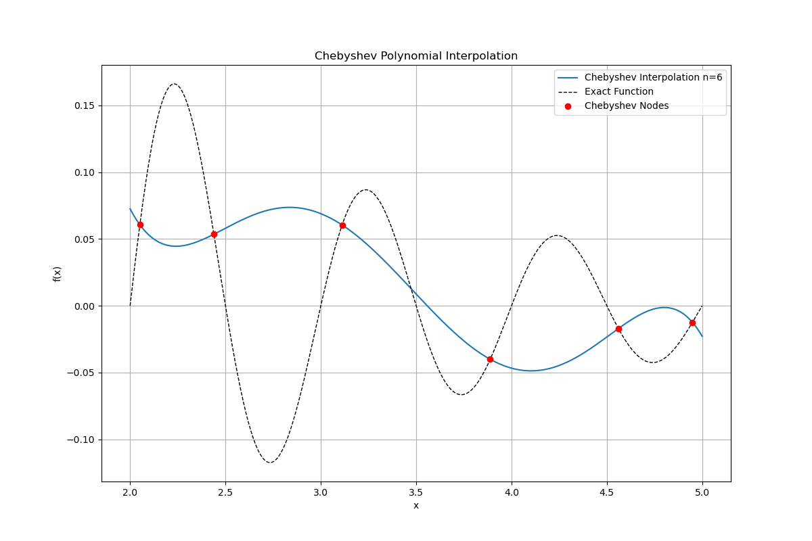
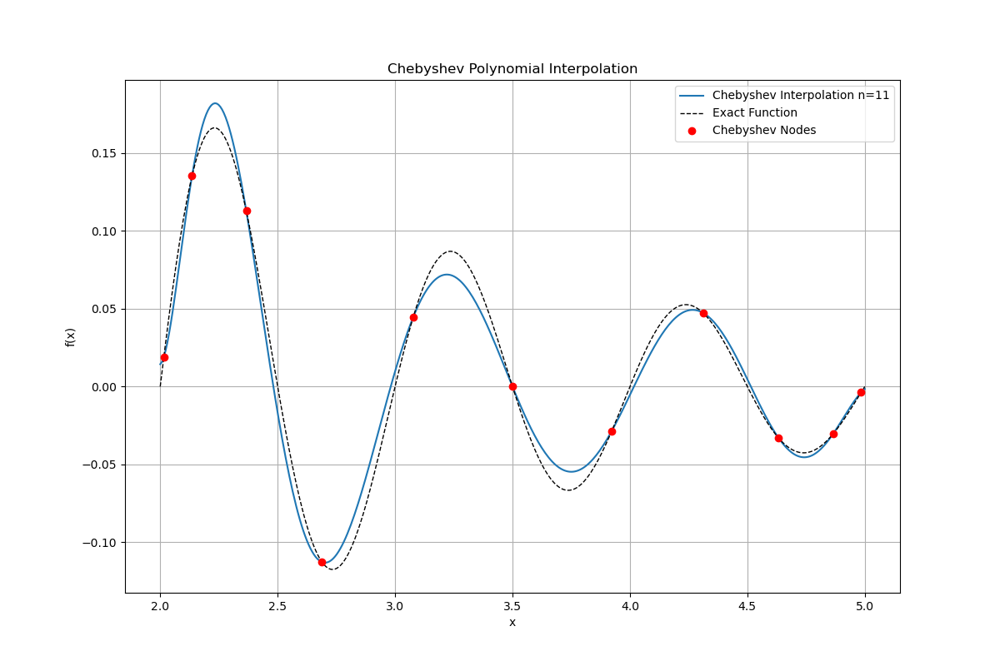
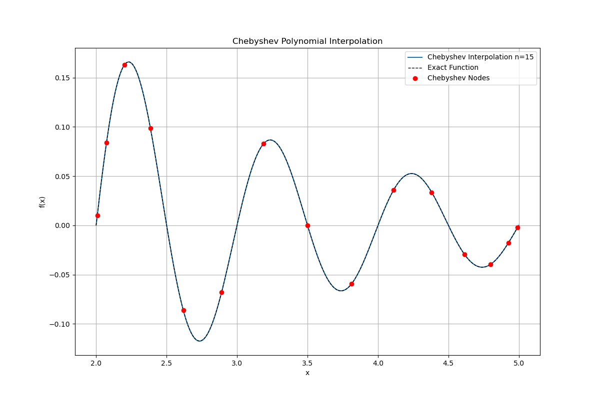
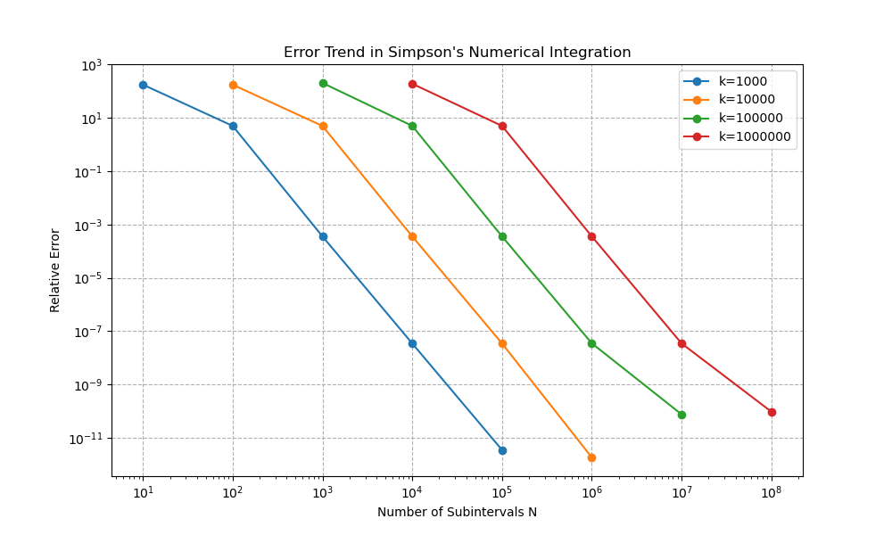
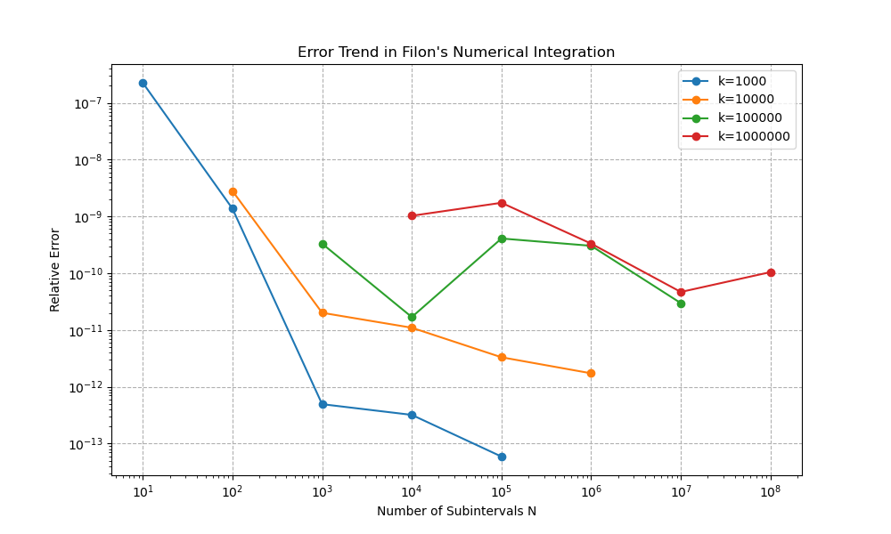

# 计算物理第三次作业

## 第一题

利用上次作业编写的Chebyshev近似函数即可：

```python
# 生成 Chebyshev 节点
def Chebyshev_nodes(a, b, n):
    nodes = []
    for k in range(n):
        x_k = 0.5 * (a + b) + 0.5 * (b - a) * np.cos((2 * k + 1) * np.pi / (2 * n))
        nodes.append(x_k)
    return nodes


# Chebyshev 多项式插值
def Chebyshev_poly_interpolation(f, a, b, n, x):
    # 生成 Chebyshev 节点
    nodes = Chebyshev_nodes(a, b, n)

    # 计算节点处的函数值
    y_values = [f(xi) for xi in nodes]

    # 使用Clenshaw算法计算Chebyshev展开
    c = []
    for k in range(n):
        sum_ck = 0
        for j in range(0, n):
            sum_ck += y_values[j] * np.cos(k * (2 * j + 1) * np.pi / (2 * n))
        ck = (2 / n) * sum_ck
        # 特殊处理c0
        if k == 0:
            ck = ck / 2
        c.append(ck)

    # 计算bk(x)并计算插值结果
    results = []
    for xi in x:
        b_kplus2 = 0
        b_kplus1 = 0
        for k in range(n - 1, 0, -1):
            b_k = 2 * xi * b_kplus1 - b_kplus2 + c[k]
            b_kplus2 = b_kplus1
            b_kplus1 = b_k
        fx = xi * b_kplus1 - b_kplus2 + c[0]
        results.append(fx)
    return results
```

需要注意的是，要把区间$[2, 5]$上的点映射到$[-1, 1]$内：

```python
x_mapped = (2 * x_vals - (a + b)) / (b - a)  # 映射到 [-1, 1]
```

结果如下：







可以看到，随着节点数增多，近似效果越来越好，在n=15时就已经与原函数相差非常小了。

## 第二题

使用复用的梯形法则、Simpson法则和Gauss-Legendre法则：

```python
# 梯形法则
def trapezoidal_rule(func, a, b, n):
    x = np.linspace(a, b, n)
    y = func(x)
    h = (b - a) / (n - 1)
    integral = (h / 2) * (y[0] + 2 * np.sum(y[1:n-1]) + y[n-1])
    return integral

# 辛普森法则
def simpsons_rule(func, a, b, n):
    if n % 2 == 0:
        n += 1  # Simpson法则需要奇数个节点
    x = np.linspace(a, b, n)
    y = func(x)
    h = (b - a) / (n - 1)
    integral = (h / 3) * (y[0] + 4 * np.sum(y[1:n-1:2]) + 2 * np.sum(y[2:n-2:2]) + y[n-1])
    return integral

# Gauss-Legendre 方法
def gauss_legendre_rule(func, a, b, n):
    [nodes, weights] = roots_legendre(n)
    # 变换节点到 [a, b]
    nodes = 0.5 * (b - a) * nodes + 0.5 * (a + b)
    weights = 0.5 * (b - a) * weights
    integral = np.sum(weights * func(nodes))
    return integral
```

其中，Gauss-Legendre法则的原理如下：

我们希望用有限个点值来近似定积分
$$
I=\int_a^b f(t)\,dt
$$
Gauss–Legendre 的思想是：在标准区间 $[-1,1]$ 上选择最优的 $n$ 个取样点 $x_i$ 和对应权重 $w_i$，使得对尽可能高阶多项式积分都能得到**精确值**。这种选择使得用 $n$ 个点能精确积分次数最多（达到 $2n-1$ 次多项式），比等距点的 Newton-Cotes 方法更高效。

把积分先变换到标准区间 $[-1,1]$，Gauss–Legendre 的近似形式为
$$
\int_{-1}^{1} f(x)\,dx \approx \sum_{i=1}^n w_i\, f(x_i),
$$
其中：

- $x_i$ 是第 $n$ 阶 **Legendre 多项式** $P_n(x)$ 的 $n$ 个实根（都在 $(-1,1)$ 内），
- 对应的权重为

$$
w_i=\frac{2}{\bigl(1-x_i^2\bigr)\,[P'_n(x_i)]^2}.
$$

把 $[-1,1]$ 上的节点 $x_i$ 映射到 $[a,b]$：
$$
t_i=\frac{b+a}{2}+\frac{b-a}{2}x_i,
$$
并且积分变换系数 $(b-a)/2$，于是
$$
\int_a^b f(t)\,dt \approx \frac{b-a}{2}\sum_{i=1}^n w_i\, f\!\left(\frac{b+a}{2}+\frac{b-a}{2}x_i\right).
$$
实现步骤如下：

1. 在标准区间用现成函数（如 `scipy.special.roots_legendre(n)`）得到 $\{x_i,w_i\}$。

2. 把节点映射到 $[a, b]$： $t_i = (a+b)/2 + (b-a)/2 \cdot x_i$。

3. 计算和： $I \approx \frac{b-a}{2}\sum_{i=1}^n w_i f(t_i)$。

结果如下：


可以看到，Gauss-Legendre方法的效果最好，很快收敛到精确值 $E_1(1)-E_{1}(100)$ 附近，其中 $E_n(z)$ 为指数积分函数。

## 第三题

### 第一问

和上一题一样，采用复化的Simpson积分方法：

```python
def simpsons_integral(func, a, b, n, k):
    if n % 2 == 0:
        n += 1  # Simpson法则需要奇数个节点
    x = np.linspace(a, b, n)
    y = func(x, k)
    h = (b - a) / (n - 1)
    integral = (h / 3) * (y[0] + 4 * np.sum(y[1:n-1:2]) + 2 * np.sum(y[2:n-2:2]) + y[n-1])
    return integral
```

不同之处是多了个参数$k$。结果如下：

| k     | N     | Numerical integral | Exact integral    | Error            |
| :---- | :---- | :----------------- | :---------------- | :--------------- |
| 1e+03 | 1e+01 | -3.9090694853e-01  | 2.2482180860e-03  | 3.9315516662e-01 |
| 1e+03 | 1e+02 | -1.6024748202e-02  | 2.2482180860e-03  | 1.8272966288e-02 |
| 1e+03 | 1e+03 | 2.2623547651e-03   | 2.2482180860e-03  | 1.4136679167e-05 |
| 1e+03 | 1e+04 | 2.2482193353e-03   | 2.2482180860e-03  | 1.2493195679e-09 |
| 1e+03 | 1e+05 | 2.2482180861e-03   | 2.2482180860e-03  | 1.2491049861e-13 |
| 1e+04 | 1e+02 | 1.4377030662e-02   | -8.3110485418e-05 | 1.4460141147e-02 |
| 1e+04 | 1e+03 | 5.9367006542e-04   | -8.3110485418e-05 | 6.7678055083e-04 |
| 1e+04 | 1e+04 | -8.3632643114e-05  | -8.3110485418e-05 | 5.2215769609e-07 |
| 1e+04 | 1e+05 | -8.3110531566e-05  | -8.3110485418e-05 | 4.6147933253e-11 |
| 1e+04 | 1e+06 | -8.3110485423e-05  | -8.3110485418e-05 | 4.4953597051e-15 |
| 1e+05 | 1e+03 | -1.9626366817e-04  | 9.7138142464e-07  | 1.9723504960e-04 |
| 1e+05 | 1e+04 | -6.8839423008e-06  | 9.7138142464e-07  | 7.8553237255e-06 |
| 1e+05 | 1e+05 | 9.7750553697e-07   | 9.7138142464e-07  | 6.1241123378e-09 |
| 1e+05 | 1e+06 | 9.7138196586e-07   | 9.7138142464e-07  | 5.4122002502e-13 |
| 1e+05 | 1e+07 | 9.7138142497e-07   | 9.7138142464e-07  | 3.3685716807e-16 |
| 1e+06 | 1e+04 | 1.7931625321e-04   | -9.5137943067e-07 | 1.8026763264e-04 |
| 1e+06 | 1e+05 | 6.7672985823e-06   | -9.5137943067e-07 | 7.7186780130e-06 |
| 1e+06 | 1e+06 | -9.5736771715e-07  | -9.5137943067e-07 | 5.9882864787e-09 |
| 1e+06 | 1e+07 | -9.5137995985e-07  | -9.5137943067e-07 | 5.2917804856e-13 |
| 1e+06 | 1e+08 | -9.5137943063e-07  | -9.5137943067e-07 | 4.1480685735e-17 |

可视化相对误差如下：



可以看到，随着$\alpha$增大，积分相对误差越来越小。即剖分点数量$N$相对于$k$越大，积分效果越好。

### 第二问

对于 $k≠0$ 的情况，先用和角公式
$$
\cos[k(x_0+t)]=\cos(kx_0)\cos(kt)-\sin(kx_0)\sin(kt),
$$
因此
$$
I_{\rm Filon}=\cos(kx_0)\int_{-h}^h (A+Bt+Ct^2)\cos(kt)\,dt
      -\sin(kx_0)\int_{-h}^h (A+Bt+Ct^2)\sin(kt)\,dt.
$$
利用奇偶性：$\cos(kt)$ 为偶，$\sin(kt)$ 为奇，故

$$
\int_{-h}^h Bt\cos(kt)\,dt=0,\quad \int_{-h}^h A\sin(kt)\,dt=0,\quad \int_{-h}^h Ct^2\sin(kt)\,dt=0
$$
于是只剩下两个非零项

$$
I_{\rm Filon} =\cos(kx_0)\Big[2A\int_0^h\cos(kt)\,dt + 2C\int_0^h t^2\cos(kt)\,dt\Big]-\sin(kx_0)\Big[2B\int_0^h t\sin(kt)\,dt\Big].
$$

计算不定积分得到
$$
\boxed{%
\begin{aligned}
I_{\rm Filon}={}&2\cos(kx_0)\Big[\;A\frac{\sin(kh)}{k}
+ C\Big(\frac{h^2\sin(kh)}{k}+\frac{2h\cos(kh)}{k^2}-\frac{2\sin(kh)}{k^3}\Big)\Big]\\
&\;{}+2B\sin(kx_0)\Big(\frac{h\cos(kh)}{k}-\frac{\sin(kh)}{k^2}\Big).
\end{aligned}
}
$$
若 $k=0$ ，直接积分得 $I_{\rm Filon}|_{k=0}=\int_{-h}^h (A+Bt+Ct^2)\,dt=2Ah+\tfrac{2}{3}Ch^3$。

### 第三问

对于$k≠0$，不妨将积分改写为
$$
I_{\text{Filon}}=\cos(kx_0)\big(A I_0 + C I_2\big) - \sin(kx_0)\big(B J_1\big),
$$
其中三个基本矩为（对 $k\neq0$）：
$$
I_0=\int_{-h}^{h}\cos(kt)\,dt=\frac{2\sin(kh)}{k},\\[6pt]
I_2=∫_{−h}^ht^2\cos(kt)\,dt=\frac{2[h^2k^2\sin(kh)+2hk\cos(kh)−2\sin(kh)]}{k^3}, \\[6pt]
J_1=∫_{−h}^ht\sin(kt)\,dt=\frac{2(−hk\cos(kh)+\sin(kh))}{k^2}.
$$
因此在每个小区间上只需求出以区间中心为基准的三点二次插值系数 $A,B,C$，再代入上式即可。

以中心点 $x_{2j+1}$ 为坐标原点，定义
$$
t = x - x_{2j+1}
$$
此时插值多项式写成
$$
p(t)=A + B t + C t^2
$$
满足
$$
p(-h)=e^{x_{2j}},\quad p(0)=e^{x_{2j+1}},\quad p(h)=e^{x_{2j+2}}.
$$
则可以得到方程组
$$
\begin{cases}
A - Bh + C h^2 = e^{x_{2j}},\\[4pt]
A = e^{x_{2j+1}},\\[4pt]
A + Bh + C h^2 = e^{x_{2j+2}}.
\end{cases}
$$
解出唯一的 $A,B,C$：
$$
\begin{cases}
A = e^{x_{2j+1}},\\[6pt]
B = \frac{e^{x_{2j+2}}-e^{x_{2j}}}{2h},\\[6pt]
C = \frac{e^{x_{2j}}+e^{x_{2j+2}}-2e^{x_{2j+1}}}{2h^2}
\end{cases}
$$
代码如下：

```python
def I0_I2_J1(k, h):
	"""
    计算积分 I0, I2, J1
    """
    kh = k * h
    if k == 0:
        I0 = 2.0 * h
        I2 = 2.0 * h**3 / 3.0
        J1 = 0.0
    else:
        I0 = 2.0 * np.sin(kh) / k
        I2 = 2.0 * (h**2 * k**2 * np.sin(kh) + 2.0 * h * k * np.cos(kh) - 2.0 * np.sin(kh)) / (k**3)
        J1 = 2.0 * (-h * k * np.cos(kh) + np.sin(kh)) / (k**2)
    return I0, I2, J1

def composite_filon_exp_cos_vectorized(k, N):
    """
    使用 Filon 方法计算积分 ∫[0,1] exp(x) * cos(kx) dx
    """
    h = 1.0 / (2.0 * N)
    # 中心点 x_mid = (2j+1)*h, j=0..N-1
    j = np.arange(N, dtype=np.float64)
    x_mid = (2.0 * j + 1.0) * h

    # 三点的函数值
    y0 = np.exp(x_mid - h)   # left
    y1 = np.exp(x_mid)       # mid
    y2 = np.exp(x_mid + h)   # right

    # 解出 A,B,C
    A = y1
    B = (y2 - y0) / (2.0 * h)
    C = (y0 + y2 - 2.0 * y1) / (2.0 * h * h)

    # 计算积分 I0, I2, J1
    I0, I2, J1 = I0_I2_J1(k, h)

    # 计算最终结果
    cos_kxm = np.cos(k * x_mid)
    sin_kxm = np.sin(k * x_mid)
    block_vals = cos_kxm * (A * I0 + C * I2) - sin_kxm * (B * J1)
    total = np.sum(block_vals)
    return total
```

结果如下：

| k     | N     | Numerical         | Exact             | Error            |
| :---- | :---- | :---------------- | :---------------- | :--------------- |
| 1e+03 | 1e+01 | 2.2482175773e-03  | 2.2482180860e-03  | 5.0867936556e-10 |
| 1e+03 | 1e+02 | 2.2482180829e-03  | 2.2482180860e-03  | 3.0901305820e-12 |
| 1e+03 | 1e+03 | 2.2482180860e-03  | 2.2482180860e-03  | 1.1110903864e-15 |
| 1e+03 | 1e+04 | 2.2482180860e-03  | 2.2482180860e-03  | 7.1991024253e-16 |
| 1e+03 | 1e+05 | 2.2482180860e-03  | 2.2482180860e-03  | 1.3270634591e-16 |
| 1e+04 | 1e+02 | -8.3110485184e-05 | -8.3110485418e-05 | 2.3383141398e-13 |
| 1e+04 | 1e+03 | -8.3110485417e-05 | -8.3110485418e-05 | 1.6717448823e-15 |
| 1e+04 | 1e+04 | -8.3110485419e-05 | -8.3110485418e-05 | 9.1209863013e-16 |
| 1e+04 | 1e+05 | -8.3110485419e-05 | -8.3110485418e-05 | 2.7531958918e-16 |
| 1e+04 | 1e+06 | -8.3110485418e-05 | -8.3110485418e-05 | 1.4361613027e-16 |
| 1e+05 | 1e+03 | 9.7138142496e-07  | 9.7138142464e-07  | 3.2242351489e-16 |
| 1e+05 | 1e+04 | 9.7138142462e-07  | 9.7138142464e-07  | 1.6426933463e-17 |
| 1e+05 | 1e+05 | 9.7138142424e-07  | 9.7138142464e-07  | 3.9754093775e-16 |
| 1e+05 | 1e+06 | 9.7138142493e-07  | 9.7138142464e-07  | 2.9557934672e-16 |
| 1e+05 | 1e+07 | 9.7138142461e-07  | 9.7138142464e-07  | 2.8908810973e-17 |
| 1e+06 | 1e+04 | -9.5137942970e-07 | -9.5137943067e-07 | 9.7830865452e-16 |
| 1e+06 | 1e+05 | -9.5137943233e-07 | -9.5137943067e-07 | 1.6567367290e-15 |
| 1e+06 | 1e+06 | -9.5137943036e-07 | -9.5137943067e-07 | 3.1624906822e-16 |
| 1e+06 | 1e+07 | -9.5137943063e-07 | -9.5137943067e-07 | 4.4509887312e-17 |
| 1e+06 | 1e+08 | -9.5137943057e-07 | -9.5137943067e-07 | 9.9587781191e-17 |



可以看到，此时的数值积分具有快速的收敛速度和高精度的结果，即使在 $\alpha=10^{-2}$ 的情形下收敛性就已经很好了；随着k和N的增大，数值积分与精确值的误差接近双精度浮点数的机器精度，说明误差极小。

## 第四题

