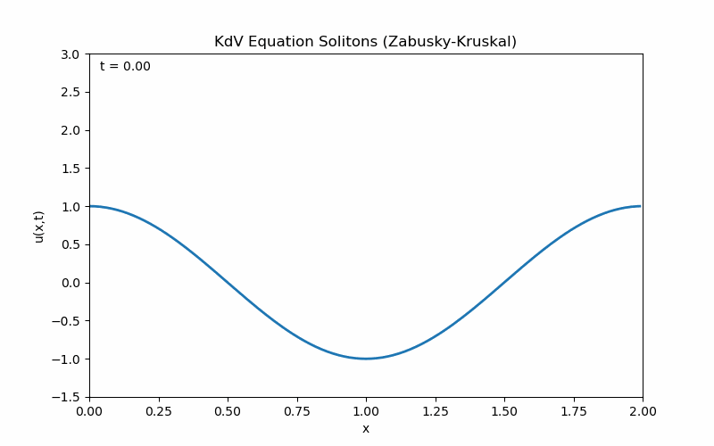
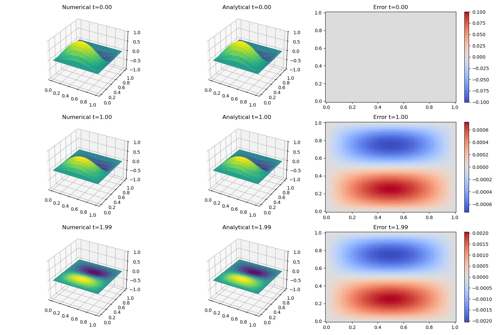
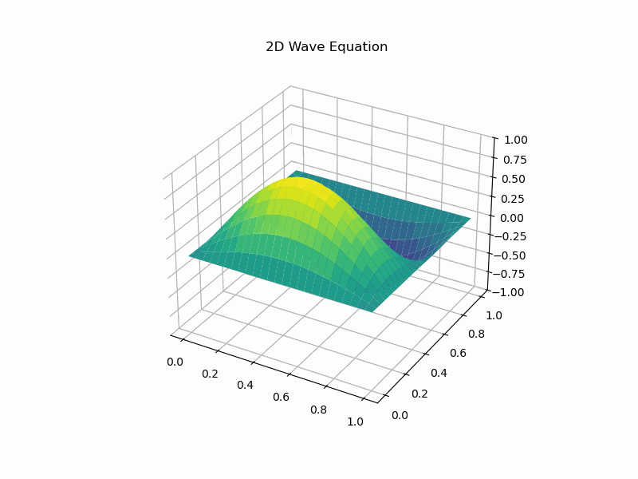
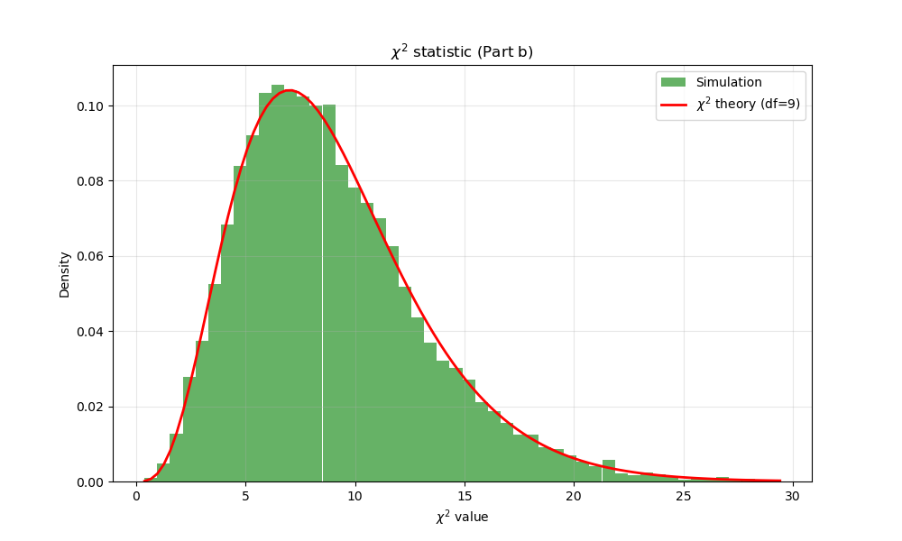

# 计算物理第四次作业

## 第一题：计算矩阵本征值

### 解答

#### 1. QR 算法

QR 算法通过反复进行 QR 分解 $A_k = Q_k R_k$ 并更新 $A_{k+1} = R_k Q_k$ 来使矩阵收敛到上三角矩阵，对于本题对称矩阵为对角矩阵。此处采用的收敛判断标准为**非对角元素的绝对值和**小于容差 $10^{-6}$。

QR 分解采用Householder变换法，原理见课件。

核心代码如下：

```python
def householder_qr(A: np.ndarray):
    """
    使用Householder变换进行QR分解
    :param A: 输入矩阵(m*n, m≥n, 列满秩)
    :return: 正交矩阵Q(m*m), 上三角矩阵R(m*n)
    """
    # 复制矩阵并转换为浮点型，避免原矩阵被修改
    m, n = A.shape
    R = A.copy().astype(float)
    # 初始化Q为m阶单位矩阵
    Q = np.eye(m, dtype=float)

    # 遍历每一列
    for k in range(n):
        # 提取当前列的子向量（从第k行到最后一行）
        x = R[k:, k].copy()
        # 计算x的2-范数
        norm_x = np.linalg.norm(x, ord=2)
        # 如果范数为0，说明该列已经是0，跳过
        if norm_x == 0:
            continue

        # 构造单位向量e1（长度和x一致）
        e1 = np.zeros_like(x)
        e1[0] = 1.0
        # 选择符号，避免数值抵消（和x[0]同号）
        sign = np.sign(x[0]) if x[0] != 0 else 1.0
        # 构造Householder向量v并归一化
        v = x + sign * norm_x * e1
        v /= np.linalg.norm(v, ord=2)

        # 构造m-k阶的Householder矩阵H
        h_size = len(v)
        H = np.eye(h_size, dtype=float) - 2.0 * np.outer(v, v)

        # 步骤1：将Householder变换应用到R的子矩阵（左乘H）
        R[k:, k:] = H @ R[k:, k:]

        # 步骤2：构造m阶的完整Householder矩阵（嵌入到单位矩阵的右下角）
        H_full = np.eye(m, dtype=float)
        H_full[k:, k:] = H

        # 步骤3：将完整的Householder矩阵应用到Q（右乘H_full）
        Q = Q @ H_full

    # 对于n×n矩阵，R的下三角部分（除了上三角）可以置0，避免数值误差导致的小值
    for i in range(m):
        for j in range(n):
            if i > j:
                R[i, j] = 0.0

    return Q, R

def qr_algorithm(A, max_iter=50, tol=1e-6):
    n = A.shape[0]
    Ak = A.copy()
    print(f"初始矩阵:\n{Ak}")
    
    for k in range(1, max_iter + 1):
        Q, R = householder_qr(Ak)
        Ak = R @ Q
        
        if k % 5 == 0:
            print(f"\n第 {k} 次迭代:")
            print(Ak)
        
        # 检查收敛性，判断非对角元素的绝对值和是否小于容差
        off_diagonal = np.sum(np.abs(Ak)) - np.sum(np.abs(np.diag(Ak)))
        if off_diagonal < tol:
            print(f"\n{k} 次迭代后收敛。")
            break
            
    print("\nQR算法特征值:", np.diag(Ak))
    return np.diag(Ak)
```

#### 2. Jacobi 算法

Jacobi 算法通过一系列相似变换（即旋转）将对称矩阵变为实舒尔形式，每次选择模最大的非对角元素进行消除。此处采用的收敛判断标准为**最大非对角元素的绝对值**小于容差 $10^{-8}$。

核心代码如下：

```python
def jacobi_algorithm(A, max_iter=1000, tol=1e-8):
    n = A.shape[0]
    Ak = A.copy()
    
    for k in range(max_iter):
        # 找到最大的非对角元素
        max_val = 0.0
        p, q = -1, -1
        for i in range(n):
            for j in range(i + 1, n):
                if abs(Ak[i, j]) > max_val:
                    max_val = abs(Ak[i, j])
                    p, q = i, j
        
        if max_val < tol:
            print(f"\n{k}次迭代后收敛。")
            break
            
        # 计算旋转参数
        if Ak[p, q] == 0:
            c = 1.0
            s = 0.0
        else:
            eta = (Ak[q, q] - Ak[p, p]) / (2 * Ak[p, q])
            if eta >= 0:
                t = 1.0 / (eta + np.sqrt(1 + eta**2))
            else:
                t = -1.0 / (-eta + np.sqrt(1 + eta**2))
            
            c = 1.0 / np.sqrt(1 + t**2)
            s = t * c
        
        # 构造Jacobi旋转矩阵
        J = np.eye(n)
        J[p, p] = c
        J[q, q] = c
        J[p, q] = s
        J[q, p] = -s
        
        Ak = J.T @ Ak @ J
        
    print("\nJacobi算法特征值:", np.diag(Ak))
    return np.diag(Ak)
```

#### 3. Sturm 序列 + 对分法

利用 Sturm 序列的性质计算给定区间内本征值的个数，结合对分法确定本征值。此处采用的收敛判断标准为区间宽度小于容差 $10^{-6}$。算法原理见课件。

核心代码如下：

```python
def sturm_sequence_count(d, e, lam):
    """
    计算Sturm序列在λ处的符号变化次数
    :param d: 矩阵的对角元素
    :param e: 矩阵的副对角元素
    """
    n = len(d)
    
    # 初始化Sturm序列，P0(λ) = 1.0
    seq = [1.0]

    # 计算P1(λ) = d[0] - λ
    val = d[0] - lam

    # 用一个非常小的数替换零值，方便符号变化的计算
    if val == 0:
        val = 1e-15
    seq.append(val)
    
    # 递推计算P_k(λ)： P_k(λ) = (d[k-1] - λ) * P_{k-1}(λ) - (e[k-2])^2 * P_{k-2}(λ)
    for k in range(2, n + 1):
        val = (d[k-1] - lam) * seq[-1] - (e[k-2]**2) * seq[-2]
        # 替换零值
        if val == 0:
            val = 1e-15
        seq.append(val)
        
    # 计算符号变化次数
    changes = 0
    for i in range(len(seq) - 1):
        if (seq[i] > 0 and seq[i+1] < 0) or (seq[i] < 0 and seq[i+1] > 0):
            changes += 1
    return changes

def sturm_bisection(A, tol=1e-6):
    # 提取对角线和副对角线元素
    d = np.diag(A)
    e = np.diag(A, k=1) 
    n = len(d)
    
    # 利用Gerschgorin圆盘定理计算特征值的初始搜索区间
    max_val = -np.inf
    min_val = np.inf
    for i in range(n):
        row_sum = np.sum(np.abs(A[i, :])) - abs(A[i, i])
        if (row_sum + A[i, i]) > max_val:
            max_val = row_sum + A[i, i]
        if (A[i, i] - row_sum) < min_val:
            min_val = A[i, i] - row_sum
    
    # 避免边界问题，稍微扩大区间
    low = min_val - 1.0
    high = max_val + 1.0
    
    print(f"\n搜索区间: [{low}, {high}]")
    
    found_evals = []
    # 求解第1到第n个特征值（对应k=1到n）
    for k in range(1, n + 1):
        a, b = low, high
        
        for _ in range(100): # 最多迭代100次
            mid = (a + b) / 2
            count = sturm_sequence_count(d, e, mid)
            if count < k:
                # 符号变化次数小于k，说明第k个特征值在mid右侧，更新左边界
                a = mid
            else:
                # 符号变化次数≥k，说明第k个特征值在mid左侧或等于mid，更新右边界
                b = mid
            
            if abs(b - a) < tol:
                break
        
        found_evals.append((a + b) / 2)
        
    print("\nSturm序列+二分法特征值:", np.array(found_evals))
    return np.array(found_evals)
```

### 结果

三种方法计算得到的本征值高度一致：

- **QR 算法**: `[4.74528124, 3.17728292, 1.82271708, 0.25471876]`

- **Jacobi 算法**: `[0.25471876, 3.17728292, 1.82271708, 4.74528124]`

- **Sturm 序列 + 二分法**: `[0.25471872, 1.82271689, 3.17728311, 4.74528128]`

QR算法迭代过程中的矩阵为：

```
第 5 次迭代:
[[ 4.29276628e+00 -7.21313977e-01  3.04034881e-16 -1.52321146e-16]
 [-7.21313977e-01  3.55611356e+00 -3.34967464e-01 -2.34843862e-16]
 [ 0.00000000e+00 -3.34967464e-01  1.89640130e+00 -3.99652715e-04]
 [ 0.00000000e+00  0.00000000e+00 -3.99652715e-04  2.54718859e-01]]

第 10 次迭代:
[[ 4.73418406e+00 -1.31448547e-01  3.97342075e-16 -2.28200139e-17]
 [-1.31448547e-01  3.18812610e+00 -1.85822775e-02 -2.92768574e-16]
 [ 0.00000000e+00 -1.85822775e-02  1.82297108e+00 -2.07643132e-08]
 [ 0.00000000e+00  0.00000000e+00 -2.07643133e-08  2.54718760e-01]]

第 15 次迭代:
[[ 4.74507887e+00 -1.78120256e-02  4.03511097e-16 -1.43164002e-18]
 [-1.78120256e-02  3.17748431e+00 -1.15075434e-03 -2.94120430e-16]
 [ 0.00000000e+00 -1.15075434e-03  1.82271806e+00 -1.10655208e-12]
 [ 0.00000000e+00  0.00000000e+00 -1.10658664e-12  2.54718760e-01]]

第 20 次迭代:
[[ 4.74527757e+00 -2.39738535e-03  4.04242455e-16  1.46021165e-18]
 [-2.39738535e-03  3.17728658e+00 -7.14944440e-05 -2.94147725e-16]
 [ 0.00000000e+00 -7.14944440e-05  1.82271708e+00 -2.46592525e-17]
 [ 0.00000000e+00  0.00000000e+00 -5.89784840e-17  2.54718760e-01]]

第 25 次迭代:
[[ 4.74528117e+00 -3.22632786e-04  4.04339745e-16  1.84942387e-18]
 [-3.22632786e-04  3.17728299e+00 -4.44210350e-06 -2.94147234e-16]
 [ 0.00000000e+00 -4.44210350e-06  1.82271708e+00  3.43015275e-17]
 [ 0.00000000e+00  0.00000000e+00 -3.14341662e-21  2.54718760e-01]]

第 30 次迭代:
[[ 4.74528124e+00 -4.34188356e-05  4.04352902e-16  1.90180274e-18]
 [-4.34188356e-05  3.17728292e+00 -2.75997750e-07 -2.94147006e-16]
 [ 0.00000000e+00 -2.75997750e-07  1.82271708e+00  3.43037661e-17]
 [ 0.00000000e+00  0.00000000e+00 -1.67536827e-25  2.54718760e-01]]

第 35 次迭代:
[[ 4.74528124e+00 -5.84316066e-06  4.04354678e-16  1.90885171e-18]
 [-5.84316066e-06  3.17728292e+00 -1.71483532e-08 -2.94146967e-16]
 [ 0.00000000e+00 -1.71483531e-08  1.82271708e+00  3.43037101e-17]
 [ 0.00000000e+00  0.00000000e+00 -8.92932493e-30  2.54718760e-01]]

第 40 次迭代:
[[ 4.74528124e+00 -7.86352881e-07  4.04354918e-16  1.90980034e-18]
 [-7.86352881e-07  3.17728292e+00 -1.06546534e-09 -2.94146961e-16]
 [ 0.00000000e+00 -1.06546526e-09  1.82271708e+00  3.43037066e-17]
 [ 0.00000000e+00  0.00000000e+00 -4.75912342e-34  2.54718760e-01]]

42 次迭代后收敛。
```

---

## 第二题：幂次法求矩阵最大模本征值

### 解答

#### 第一小问

注意到 $x''=-Ax$ ，再由 $x''=(-i\omega)^2x=-\omega^2x$ 即可得
$$
Ax=\omega^2x=\lambda x,\quad \lambda=\omega^2
$$

#### 第二小问

由题可得，矩阵 $A$ 的形式为：

```
矩阵 A:
[[ 2. -1.  0.  0.  0.  0.  0.  0.  0. -1.]
 [-1.  2. -1.  0.  0.  0.  0.  0.  0.  0.]
 [ 0. -1.  2. -1.  0.  0.  0.  0.  0.  0.]
 [ 0.  0. -1.  2. -1.  0.  0.  0.  0.  0.]
 [ 0.  0.  0. -1.  2. -1.  0.  0.  0.  0.]
 [ 0.  0.  0.  0. -1.  2. -1.  0.  0.  0.]
 [ 0.  0.  0.  0.  0. -1.  2. -1.  0.  0.]
 [ 0.  0.  0.  0.  0.  0. -1.  2. -1.  0.]
 [ 0.  0.  0.  0.  0.  0.  0. -1.  2. -1.]
 [-1.  0.  0.  0.  0.  0.  0.  0. -1.  2.]]
```

迭代公式：$z^{(k)} = A q^{(k-1)}$, $q^{(k)} = z^{(k)} / \|z^{(k)}\|$ ； $q^TAq$ 即为本征值。

```python
def power_method(A, max_iter=2000, tol=1e-10):
    """
    使用幂次法求解矩阵的最大特征值及其对应的特征向量。
    """
    n = A.shape[0]
    # 从随机向量开始，使用固定种子以保证结果可复现
    np.random.seed(42)
    q = np.random.rand(n)
    q = q / np.linalg.norm(q)
    
    lambda_k = 0.0
    
    print(f"{'迭代次数':<10} {'特征值':<20} {'相邻两次迭代的误差':<20}")
    print("-" * 50)
    
    for k in range(1, max_iter + 1):
        z = A @ q
        
        # 计算瑞利商作为特征值估计
        lambda_next = np.dot(q, z)
        
        # 归一化得到新的q
        norm_z = np.linalg.norm(z)
        q_next = z / norm_z
        
        diff = np.abs(lambda_next - lambda_k)
        
        if k % 10 == 0 or k == 1:
            print(f"{k:<10} {lambda_next:<20.8f} {diff:<20.2e}")
            
        if diff < tol:
            print(f"\n在第 {k} 次迭代收敛")
            return lambda_next, q_next
            
        q = q_next
        lambda_k = lambda_next
        
    print("\n达到最大迭代次数。")
    return lambda_k, q
```

### 结果

对于 $N=10$ 的情形：

- **最大本征值 ($\omega_{\text{max}}^2$)**: `4.00000000`
- **理论值**: $4 \sin^2(N\pi / 2N) = 4$。
- **本征矢**: `[-0.31623271, 0.31622465, -0.31621779, 0.31621473, -0.31621666, 0.31622282, -0.31623088, 0.31623774, -0.3162408, 0.31623887]`对应于相邻原子反向振动的模式。

---

## 第三题：孤立子数值解

### 解答

采用 **Zabusky-Kruskal 格式**，利用 **Runge-Kutta 4 (RK4)** 方法进行时间推进。

RK4 方法具有更高的精度和更好的数值稳定性，非常适合长时间模拟。将 KdV 方程写作：

$$
\frac{du}{dt}=F(u)
$$
其中空间离散算子 F 定义为：
$$
F(u_j)=-\left[ \frac{u_{j+1}^n + u_j^n + u_{j-1}^n}{3} \frac{u_{j+1}^n - u_{j-1}^n}{2\Delta x} + \delta^2 \frac{u_{j+2}^n - 2u_{j+1}^n + 2u_{j-1}^n - u_{j-2}^n}{2(\Delta x)^3} \right]
$$
RK4 方法通过下面的方式进行时间步进：
$$
k_1 = F(u^n) \\
k_2 = F\left(u^n + \frac{\Delta t}{2} k_1\right) \\
k_3 = F\left(u^n + \frac{\Delta t}{2} k_2\right) \\
k_4 = F\left(u^n + \Delta t k_3\right) \\
u^{n+1} = u^n + \frac{\Delta t}{6}(k_1 + 2k_2 + 2k_3 + k_4)
$$

核心代码：

```python
# 使用差分法计算右端项
def compute_rhs(u):
    # 使用 np.roll 处理周期性边界条件
    # u_x 近似为 (u_{j+1} - u_{j-1}) / 2dx
    # u u_x 采用 Zabusky-Kruskal 守恒格式: 1/3 (u_{j+1} + u_j + u_{j-1}) * (u_{j+1} - u_{j-1}) / 2dx
    
    u_jp1 = np.roll(u, -1)
    u_jm1 = np.roll(u, 1)
    u_jp2 = np.roll(u, -2)
    u_jm2 = np.roll(u, 2)
    
    # 非线性项: 1/3 * (u_{j+1} + u_j + u_{j-1}) * (u_{j+1} - u_{j-1}) / (2*dx)
    nonlinear = (u_jp1 + u + u_jm1) / 3.0 * (u_jp1 - u_jm1) / (2 * dx)
    
    # 色散项: delta^2 * (u_{j+2} - 2u_{j+1} + 2u_{j-1} - u_{j-2}) / (2*dx^3)
    dispersion = delta_sq * (u_jp2 - 2*u_jp1 + 2*u_jm1 - u_jm2) / (2 * dx**3)
    
    return -(nonlinear + dispersion)

# RK4 时间步进
def rk4_step(u, dt):
    k1 = compute_rhs(u)
    k2 = compute_rhs(u + 0.5 * dt * k1)
    k3 = compute_rhs(u + 0.5 * dt * k2)
    k4 = compute_rhs(u + dt * k3)
    return u + (dt / 6.0) * (k1 + 2*k2 + 2*k3 + k4)
```

### 结果

初始的余弦波分裂成一列孤立子，振幅大的速度快，振幅小的速度慢。并且可以看到，孤立子在传播过程中互不干扰，保持形状和速度不变。



---

## 第四题：二维波动方程

### 解答

#### (a) 解析解

设解形如
$$
u(x,y,t)=X(x)\,Y(y)\,T(t).
$$
代入 PDE：
$$
X''(x)Y(y)T(t)+X(x)Y''(y)T(t)=X(x)Y(y)T''(t).
$$
两边同除以 $X(x)Y(y)T(t)$ 得
$$
\frac{X''(x)}{X(x)}+\frac{Y''(y)}{Y(y)}=\frac{T''(t)}{T(t)}.
$$
左边仅含 $x,y$，右边仅含 $t$，因此两边等于常数。先对空间部分分离，令
$$
\frac{X''(x)}{X(x)}+\frac{Y''(y)}{Y(y)}=-\omega^2,
$$
则时间部分满足
$$
T''(t)+\omega^2 T(t)=0.
$$
进一步把空间项分成两常数：
$$
\frac{X''(x)}{X(x)}=-\lambda,\qquad \frac{Y''(y)}{Y(y)}=-\mu,
$$
并且 $\lambda+\mu=\omega^2$。

因此得到三个常微分方程：
$$
\begin{cases}
X''+\lambda X=0,\\[4pt]
Y''+\mu Y=0,\\[4pt]
T''+\omega^2 T=0,\quad \omega^2=\lambda+\mu.
\end{cases}
$$
边界为矩形且 $u=0$ ，所以
$$
X(0)=X(1)=0,\qquad Y(0)=Y(1)=0.
$$
于是得到：
$$
X_n(x)=\sin(n\pi x),\qquad \lambda_n=(n\pi)^2,\quad n=1,2,\dots
$$

$$
Y_m(y)=\sin(m\pi y),\qquad \mu_m=(m\pi)^2,\quad m=1,2,\dots
$$

于是每对 $(n,m)$ 对应空间模式
$$
\Phi_{nm}(x,y)=\sin(n\pi x)\sin(m\pi y),
$$
对应的角频率
$$
\omega_{nm}=\sqrt{\lambda_n+\mu_m}=\pi\sqrt{n^2+m^2}.
$$
对于每个模式 $(n,m)$，时间函数为
$$
T_{nm}(t)=A_{nm}\cos(\omega_{nm}t)+B_{nm}\sin(\omega_{nm}t).
$$
因此一般解可以写成
$$
u(x,y,t)=\sum_{n=1}^{\infty}\sum_{m=1}^{\infty}\big( A_{nm}\cos(\omega_{nm}t)+B_{nm}\sin(\omega_{nm}t)\big)\sin(n\pi x)\sin(m\pi y).
$$
初值条件 $u(x,y,0)=f(x,y)=\sin(\pi x)\sin(2\pi y)$ 给出
$$
u(x,y,0)=\sum_{n,m} A_{nm}\sin(n\pi x)\sin(m\pi y)=\sin(\pi x)\sin(2\pi y).
$$
初始速度为零给出
$$
\left.\frac{\partial u}{\partial t}\right|_{t=0}=\sum_{n,m} B_{nm}\omega_{nm}\sin(n\pi x)\sin(m\pi y)=0
$$
对所有 $(x,y)$ 成立，所以对任意 $n,m$ 有 $B_{nm}=0$。

只需求 $A_{nm}$。利用基函数的正交性：
$$
\int_0^1\int_0^1 \sin(n\pi x)\sin(m\pi y)\sin(p\pi x)\sin(q\pi y)\,dx\,dy
=\frac{\delta_{np}\delta_{mq}}{4},
$$
由此系数可写为
$$
A_{pq}=4\int_0^1\int_0^1 f(x,y)\sin(p\pi x)\sin(q\pi y)\,dx\,dy.
$$
对 $f(x,y)=\sin(\pi x)\sin(2\pi y)$：
$$
A_{pq}=4\int_0^1\int_0^1 \sin(\pi x)\sin(2\pi y)\sin(p\pi x)\sin(q\pi y)\,dx\,dy.
$$
仅当 $p=1$ 且 $q=2$ 时非零。计算该项：
$$
A_{12}=4\Big(\int_0^1\sin^2(\pi x)\,dx\Big)\Big(\int_0^1\sin^2(2\pi y)\,dy\Big)
=4\cdot\frac{1}{2}\cdot\frac{1}{2}=1.
$$
其余 $A_{nm}=0$。

故最终解为
$$
\,u(x,y,t)=\cos(\omega_{12}t)\sin(\pi x)\sin(2\pi y)
$$
其中
$$
\omega_{12}=\pi\sqrt{1^2+2^2}=\pi\sqrt{5}.
$$
即
$$
\boxed{\,u(x,y,t)=\cos\!\big(\pi\sqrt{5}\,t\big)\,\sin(\pi x)\sin(2\pi y)\,.}
$$

#### (b) 数值解

对于边界条件，每一步时间更新后显式将边界格点置零：

```python
u_np1[0, :] = 0.0
u_np1[-1, :] = 0.0
u_np1[:, 0] = 0.0
u_np1[:, -1] = 0.0
```

对于初始条件，有：

- 对于 $u(x,y,0)=\sin(\pi x)\sin(2\pi y)$ 直接在网格上赋值：

	```python
	u_prev[:, :] = np.sin(np.pi * X) * np.sin(2 * np.pi * Y)
	```
	
- 对于 $\left.\partial_t u\right|_{t=0} = 0$ ，将方程在初始点做 Taylor 展开：
  $$
  u(x,y,\Delta t)=u(x,y,0)+\Delta t\,u_t(x,y,0)+\frac{\Delta t^2}{2}u_{tt}(x,y,0)+O(\Delta t^3).
  $$
  而波动方程给出 $u_{tt}=\nabla^2 u$，故当初速度 $u_t(x,y,0)=0$ 时，上式变为
  $$
  u^{1}=u^{0}+\frac{\Delta t^2}{2}\nabla^2 u^{0}+O(\Delta t^3).
  $$
  即下面的代码中的第11行：
  
  ```python
  u_prev[:, :] = np.sin(np.pi * X) * np.sin(2 * np.pi * Y)
  u_nm1 = u_prev.copy() # u^{n-1}
  u_n = u_nm1.copy()
  
  rx2 = (dt / dx)**2
  ry2 = (dt / dy)**2
  
  # 计算 u^1
  u_nm1_xx = u_nm1[2:, 1:-1] - 2*u_nm1[1:-1, 1:-1] + u_nm1[:-2, 1:-1]
  u_nm1_yy = u_nm1[1:-1, 2:] - 2*u_nm1[1:-1, 1:-1] + u_nm1[1:-1, :-2]
  u_n[1:-1, 1:-1] = u_nm1[1:-1, 1:-1] + 0.5 * (rx2 * u_nm1_xx + ry2 * u_nm1_yy)
  ```

结果如图：



可以看到，由于按照初始值设定初始状态，初始时刻误差为零；随时间推移图中误差条最大值变大，即误差变大。

#### (c) 稳定性分析

稳定性条件：$\Delta t \leq \frac{1}{\sqrt{\lambda}} \left( \frac{1}{\Delta x^2} + \frac{1}{\Delta y^2} \right)^{-1/2}$，且$\lambda \ge 1$。

- 当 $\lambda=2.0$ (满足 CFL) 时，模拟稳定。
- 当 $\lambda=0.8$ (不满足 CFL) 时，模拟发散。

#### (d) 动画演示

取网格数`Nx=Ny=100`，模拟时间`T_max=5.0`，步长`dt=0.001`得到动画：


---

## 第五题：随机数产生器

### 题目描述

验证随机数分布性质，并实现 16807 产生器。

### 解答

#### (a) 分布检验

统计落入 $[0.6, 0.7]$ 区间的比例，结果符合正态分布。


#### (b) $\chi^2$ 检验

计算 $\chi^2 = \sum \frac{(O_i - E_i)^2}{E_i}$，结果符合自由度为 9 的 $\chi^2$ 分布。



#### (c) 16807 产生器

实现线性同余发生器：

```python
class LCG16807:
    def __init__(self, seed=1):
        self.state = seed
        self.a = 16807
        self.m = 2147483647
        
    def next(self):
        self.state = (self.a * self.state) % self.m
        return self.state
```

验证结果：$x(10000) = 1043618065$，验证成功。
